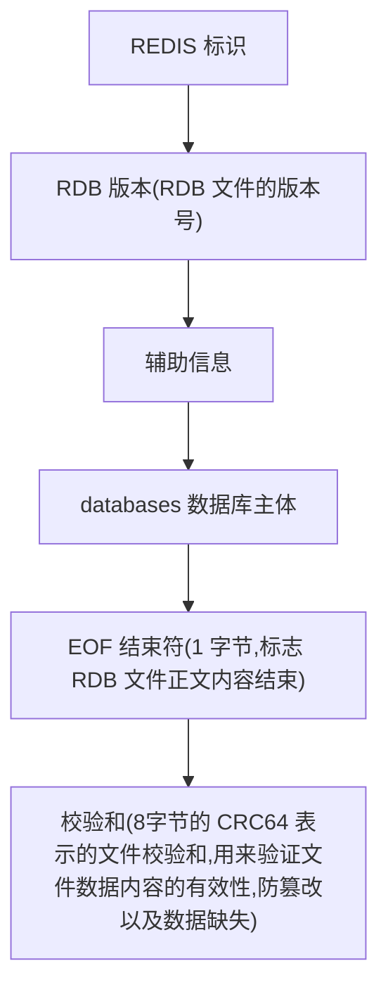
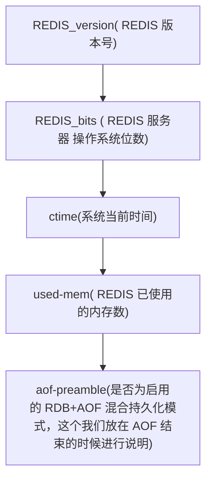
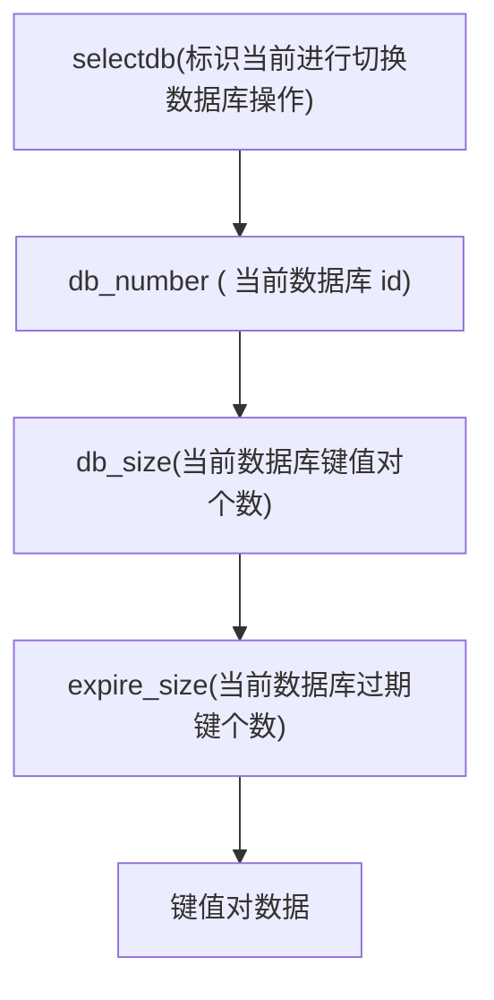

# REDIS

## 1.Redis 底层数据结构

### 1-1.Redis dict(字典)

dict类似java中map，是键值对。Redis很多操作都基于dict。

dict字典中有两个哈希表，一般使用ht[0]，只有在rehash(扩容和缩减)时才使用ht[1].

```c
//字典
typedef struct dict {
    dictType *type; //字典类型
    void *privdata; //私有数据
    dictht ht[2];	//哈希表，一般有两部分，正常哈希表数据部分 + rehash重置哈希表的暂存数据部分
    long rehashidx; //是否正在进行哈希重置，默认为不重置 rehashidx == -1
    unsigned long iterators; // 正在运行的迭代器数
}

//哈希表
typedef struct dictht {
    dictEntry **table; //哈希表数据，数组+链表
    unsigned long size; //size 2的幂次
    unsigned long sizemask;//size-1
    unsigned long used; //存储数量
}

//每个间值对元素，链表
typedef struct dictEntry {
    void *key; //键
    union {
        void *val;
        uint64_t u64;
        int64_t s64;
        double d;
    } v; //值
    struct dictEntry *next; //指向下一个 hash 节点的地址
}
```

### 哈希表的新增:

​		1.根据key计算hash

​		2.hash与table.size-1相与，取到当前key存储的table的位置

​		3.新节点插入到表头

```c
int dictAdd(dict *d, void *key, void *val){
    //设置一个只有空值的Entry
    dictEntry *entry = dictAddRaw(d,key,NULL);
    if (!entry) return DICT_ERR;
    //设置Entry的val
    dictSetVal(d, entry, val);
    return DICT_OK;
}

dictEntry *dictAddRaw(dict *d, void *key, dictEntry **existing){
    long index;
    dictEntry *entry;
    dictht *ht;

    if (dictIsRehashing(d)) _dictRehashStep(d);

    //-1代表key已经存在，否使new一个新的Entry
    if ((index = _dictKeyIndex(d, key, dictHashKey(d,key), existing)) == -1)
        return NULL;

    ht = dictIsRehashing(d) ? &d->ht[1] : &d->ht[0];
    entry = zmalloc(sizeof(*entry));
    //新节点插入到表头
    entry->next = ht->table[index];
    ht->table[index] = entry;
    ht->used++;

    dictSetKey(d, entry, key);
    return entry;
}
```

### 字典rehash：

​		触发rehash：1.调用_dictRehashStep()

​								2.定时dictRehashMilliseconds()


​		扩容将ht[0]数据重新hash迁移到ht[1],新表的size是旧表的2倍，当前迁移时设置

​		rehashidx标识，读写时会往新表里读写，直到ht[0]迁移结束，将ht[1]指向ht[0]，

​		最后更新rehashidx标识。

```c
int dictRehash(dict *d, int n) {
    int empty_visits = n*10; 
    if (!dictIsRehashing(d)) return 0;

    while(n-- && d->ht[0].used != 0) {
        dictEntry *de, *nextde;

        assert(d->ht[0].size > (unsigned long)d->rehashidx);
        while(d->ht[0].table[d->rehashidx] == NULL) {
            d->rehashidx++;
            if (--empty_visits == 0) return 1;
        }
        de = d->ht[0].table[d->rehashidx];
      
        while(de) {
            uint64_t h;

            nextde = de->next;
       
            h = dictHashKey(d, de->key) & d->ht[1].sizemask;
            de->next = d->ht[1].table[h];
            d->ht[1].table[h] = de;
            d->ht[0].used--;
            d->ht[1].used++;
            de = nextde;
        }
        d->ht[0].table[d->rehashidx] = NULL;
        d->rehashidx++;
    }

    if (d->ht[0].used == 0) {
        zfree(d->ht[0].table);
        d->ht[0] = d->ht[1];
        _dictReset(&d->ht[1]);
        d->rehashidx = -1;
        return 0;
    }
    return 1;
}
```

### 1-2. ziplist压缩列表

ziplist压缩列表结构:

​	zlbytes(整个压缩列表占用字节数)->zltail(压缩列表起始节点到尾节点的字节数)->zllen(压缩列表节点长度)

->entry...(压缩列表存储节点链表)->zlend(存储特殊值0xFF ( =255 ) ，用于标记压缩列表尾端)


ziplist存储内存是连续的，内存紧凑，占用内存少，更容易加载到CPU

```c
//每一个节点,都能存储一个字节数组或整数值
typedef struct zlentry {
    unsigned int prevrawlensize; //前一个节点的长度
    unsigned int prevrawlen;     //前一个节点编码所需长度   
    unsigned int lensize;        //当前节点长度   
    unsigned int len;       	 //当前节点编码所需长度
    unsigned int headersize;     //头大小 
    unsigned char encoding;      // 编码类型 
    unsigned char *p;            // 字节指针 
}

previous_entry_length : 即（前一个节点指针地址=当前节点指针地址-previous_entry_length）
    	用于逆向遍历。若节点长度小于254,则前一个节点属性长度为1个字节，
    	否则一个节点的属性长度为5个字节。
encoding  :  记录了节点content属性所保存数据的类型和长度
```

### ziplist的创建

​		1.申请表头和表尾的内存（10B+1B）

​		2.设置zlbytes/zltail/zllen/zlend的值

```c
//ZIPLIST头存储长度 32位:总字节数 32位:到最后一个节点的偏移量  16位:节点字段数量
//zlbytes+zltail+zllen
define ZIPLIST_HEADER_SIZE     (sizeof(uint32_t)*2+sizeof(uint16_t))
//存储特殊值0xFF ( =255 ) ，用于标记压缩列表尾端  1个字节
define ZIPLIST_END_SIZE        (sizeof(uint8_t))
define ZIP_END 255
    
unsigned char *ziplistNew(void) {
    //ziplist头+尾需要的内存
    unsigned int bytes = ZIPLIST_HEADER_SIZE+ZIPLIST_END_SIZE;
    //申请分配内存
    unsigned char *zl = zmalloc(bytes);
    //ziplist总字节数
    ZIPLIST_BYTES(zl) = intrev32ifbe(bytes);
    //设定尾节点相对头部的偏移量
    ZIPLIST_TAIL_OFFSET(zl) = intrev32ifbe(ZIPLIST_HEADER_SIZE);
    //节点数量,初始0个
    ZIPLIST_LENGTH(zl) = 0;
    //设置最后一个字节为结束标记符
    zl[bytes-1] = ZIP_END;
    return zl;
}
```

### ziplist的新增

​		1.获取上一个节点的偏移量

​		2.将当前内容进行编码，计算出当前节点的编码长度

​		3.判断空间是否足够插入

​		4.扩容

​		5.插入节点并设置节点值

```c
define ZIPLIST_HEAD 0
//前一个节点的最大字节
define ZIP_BIG_PREVLEN 254
//返回第一个节点的指针
define ZIPLIST_ENTRY_HEAD(zl)  ((zl)+ZIPLIST_HEADER_SIZE)
//返回节点链表的最后指针，即尾节点的前一个节点
define ZIPLIST_ENTRY_END(zl)   ((zl)+intrev32ifbe(ZIPLIST_BYTES(zl))-1)
//最后一个节点的偏移量
define ZIPLIST_TAIL_OFFSET(zl) (*((uint32_t*)((zl)+sizeof(uint32_t))))
define ZIPLIST_ENTRY_TAIL(zl)  ((zl)+intrev32ifbe(ZIPLIST_TAIL_OFFSET(zl)))
    
//返回前一个元素的长度和字节数 
define ZIP_DECODE_PREVLENSIZE(ptr, prevlensize) do {  
    //若节点长度小于254,则前一个节点属性长度为1个字节，否则一个节点的属性长度为5个字节
    if ((ptr)[0] < ZIP_BIG_PREVLEN) {                                          
        (prevlensize) = 1;                                                     
    } else {                                                                   
        (prevlensize) = 5;                                                     
    }                                                                          
} while(0);
define ZIP_DECODE_PREVLEN(ptr, prevlensize, prevlen) do {     
    //计算前一个节点属性的长度
    ZIP_DECODE_PREVLENSIZE(ptr, prevlensize);                                  
    if ((prevlensize) == 1) {  
        //只有一位,当前节点的值就是前一个节点的长度
        (prevlen) = (ptr)[0];                                                  
    } else if ((prevlensize) == 5) {                                           
        assert(sizeof((prevlen)) == 4);
        //5位，第一个字节(0xFE( =254 )),后4个字节保存前一个节点的长度
        memcpy(&(prevlen), ((char*)(ptr)) + 1, 4);                             
        memrev32ifbe(&prevlen);                                                
    }                                                                          
} while(0);

//计算节点长度
unsigned int zipRawEntryLength(unsigned char *p) {
    unsigned int prevlensize, encoding, lensize, len;
    //计算前一个节点属性的长度
    ZIP_DECODE_PREVLENSIZE(p, prevlensize);
    ZIP_DECODE_LENGTH(p + prevlensize, encoding, lensize, len);
    return prevlensize + lensize + len;
}

//往表尾添加
unsigned char *ziplistPush(unsigned char *zl, unsigned char *s,
                           unsigned int slen, int where) {
    unsigned char *p;
    //where==0返回第一个节点的起始位置，否则返回尾位置
    p = (where == ZIPLIST_HEAD) ? ZIPLIST_ENTRY_HEAD(zl) : ZIPLIST_ENTRY_END(zl);
    return __ziplistInsert(zl,p,s,slen);
}

//往表头添加
unsigned char *ziplistInsert(unsigned char *zl, unsigned char *p, 
                             unsigned char *s, unsigned int slen) {
    return __ziplistInsert(zl,p,s,slen);
}

unsigned char *__ziplistInsert(unsigned char *zl, unsigned char *p, 
                               unsigned char *s, unsigned int slen) {
    //当前压缩链表长度
    size_t curlen = intrev32ifbe(ZIPLIST_BYTES(zl)), reqlen;
    //前一个节点的长度
    unsigned int prevlensize, prevlen = 0;
    size_t offset;
    int nextdiff = 0;
    unsigned char encoding = 0;
    //初始化失败警告
    long long value = 123456789;
    zlentry tail;

    //如果不是结尾(0xff)代表不是空表
    if (p[0] != ZIP_END) {
     	//获取上一个节点的长度和上一个节点编码长度
        ZIP_DECODE_PREVLEN(p, prevlensize, prevlen);
    } else {
        //尾节点地址
        unsigned char *ptail = ZIPLIST_ENTRY_TAIL(zl);
        if (ptail[0] != ZIP_END) {
            //若不是空表，计算尾节点长度
            prevlen = zipRawEntryLength(ptail);
        }
    }

    //先尝试整数编码
    if (zipTryEncoding(s,slen,&value,&encoding)) {
       	// 整数编码长度
        reqlen = zipIntSize(encoding);
    } else {
       	//字符编码
        reqlen = slen;
    }
   
    // 前一个节点的编码长度
    reqlen += zipStorePrevEntryLength(NULL,prevlen);
    //当前节点的编码长度
    reqlen += zipStoreEntryEncoding(NULL,encoding,slen);

    int forcelarge = 0;
    //若不是尾端插入,zipPrevLenByteDiff判断空间是否足够，nextdiff:相差多少空间
    nextdiff = (p[0] != ZIP_END) ? zipPrevLenByteDiff(p,reqlen) : 0;
    //nextdiff:相差为 -4 代表需要扩展
    if (nextdiff == -4 && reqlen < 4) {
        nextdiff = 0;
        forcelarge = 1;
    }
    
	// 存储p相对于列表zl的偏移地址，这里存储 偏移量而不是直接 指针地址，是因为可能 扩展空间而地址改变
    offset = p-zl;
    // 扩展空间，curlen 当前列表长度，reqlen 新节点长度，新节点后继节点header 偏移长度
    zl = ziplistResize(zl,curlen+reqlen+nextdiff);
    //p节点的新地址
    p = zl+offset;

   // 非表尾插入，需要重新计算表尾的偏移量
    if (p[0] != ZIP_END) {
       	// 移动现有元素，为新元素的插入提供空间
        memmove(p+reqlen,p-nextdiff,curlen-offset-1+nextdiff);
        // p+reqlen为新节点前置节点移动后的位置，将新节点的长度编码至前置节点
        if (forcelarge)
            zipStorePrevEntryLengthLarge(p+reqlen,reqlen);
        else
            zipStorePrevEntryLength(p+reqlen,reqlen);

        // 更新列表尾相对于表头的偏移量，将新节点的长度算上
        ZIPLIST_TAIL_OFFSET(zl) =
            intrev32ifbe(intrev32ifbe(ZIPLIST_TAIL_OFFSET(zl))+reqlen);

       // 如果新节点后面有多个节点，那么表尾的偏移量需要算上nextdiff的值
        zipEntry(p+reqlen, &tail);
        if (p[reqlen+tail.headersize+tail.len] != ZIP_END) {
            ZIPLIST_TAIL_OFFSET(zl) =
                intrev32ifbe(intrev32ifbe(ZIPLIST_TAIL_OFFSET(zl))+nextdiff);
        }
    } else {
        // 表尾插入，直接计算偏移量
        ZIPLIST_TAIL_OFFSET(zl) = intrev32ifbe(p-zl);
    }

    // 当nextdiff不为0时，表示需要新节点的后继节点对头部进行扩展
    if (nextdiff != 0) {
        offset = p-zl;
        // 需要对p所指向的机电header进行扩展更新，有可能会引起连锁更新
        zl = __ziplistCascadeUpdate(zl,p+reqlen);
        p = zl+offset;
    }

   	// 将新节点前置节点的长度写入新节点的header
    p += zipStorePrevEntryLength(p,prevlen);
    // 将新节点的值长度写入新节点的header
    p += zipStoreEntryEncoding(p,encoding,slen);
    // 写入节点值
    if (ZIP_IS_STR(encoding)) {
        memcpy(p,s,slen);
    } else {
        zipSaveInteger(p,value,encoding);
    }
    // 更新列表节点计数
    ZIPLIST_INCR_LENGTH(zl,1);
    return zl;
}

//ziplist扩容
unsigned char *ziplistResize(unsigned char *zl, unsigned int len) {
    zl = zrealloc(zl,len);
    ZIPLIST_BYTES(zl) = intrev32ifbe(len);
    zl[len-1] = ZIP_END;
    return zl;
}

```

### ziplist的查询

​		1.根据index判断是正向查询还是逆向查询

​			2.若是正向，获取头节点的偏移量，后移index个节点

​			3.若是逆向,	获取为节点的偏移量, 每个节点都记录了前置节点的长度，前移index个节点

```C
unsigned char *ziplistIndex(unsigned char *zl, int index) {
    unsigned char *p;
    unsigned int prevlensize, prevlen = 0;
    // index为负，从尾部开始遍历
    if (index < 0) {
        index = (-index)-1;
        // 获取尾指针
        p = ZIPLIST_ENTRY_TAIL(zl);
        if (p[0] != ZIP_END) {
            // 解码前置节点长度
            ZIP_DECODE_PREVLEN(p, prevlensize, prevlen);
            while (prevlen > 0 && index--) {
                p -= prevlen;
                // 解码前置节点长度
                ZIP_DECODE_PREVLEN(p, prevlensize, prevlen);
            }
        }
    } else {
        // index为正，从头部开始遍历
        p = ZIPLIST_ENTRY_HEAD(zl);
        while (p[0] != ZIP_END && index--) {
             // 获取当前节点的整体长度，包括pre_entry_length，encoding，contents三部分
            p += zipRawEntryLength(p);
        }
    }
    return (p[0] == ZIP_END || index > 0) ? NULL : p;
}
```

### ziplist的删除

```c
unsigned char *ziplistDelete(unsigned char *zl, unsigned char **p) {
    size_t offset = *p-zl;
    zl = __ziplistDelete(zl,*p,1);
    *p = zl+offset;
    return zl;
}

unsigned char *__ziplistDelete(unsigned char *zl, unsigned char *p, unsigned int num) {
    unsigned int i, totlen, deleted = 0;
    size_t offset;
    int nextdiff = 0;
    zlentry first, tail;

    // 获取p指向的节点信息
    zipEntry(p, &first);
    // 计算num个节点占用的内存
    for (i = 0; p[0] != ZIP_END && i < num; i++) {
        p += zipRawEntryLength(p);
        deleted++;
    }

    totlen = p-first.p; 
    if (totlen > 0) {
        if (p[0] != ZIP_END) {
            // 执行到这里，表示被删除节点后面还存在节点
            // 判断最后一个被删除的节点的后继节点的header中的存放前置节点长度的空间
            // 能不能容纳第一个被删除节点的前置节点的长度
            nextdiff = zipPrevLenByteDiff(p,first.prevrawlen);
            p -= nextdiff;
            zipStorePrevEntryLength(p,first.prevrawlen);

             // 更新尾部相对于头部的偏移量
            ZIPLIST_TAIL_OFFSET(zl) =
                intrev32ifbe(intrev32ifbe(ZIPLIST_TAIL_OFFSET(zl))-totlen);

             // 如果被删除节点后面还存在节点，就需要将nextdiff计算在内
            zipEntry(p, &tail);
            if (p[tail.headersize+tail.len] != ZIP_END) {
                ZIPLIST_TAIL_OFFSET(zl) =
                   intrev32ifbe(intrev32ifbe(ZIPLIST_TAIL_OFFSET(zl))+nextdiff);
            }

           // 将被删除节点后面的内存空间移动到删除的节点之后
            memmove(first.p,p,
                intrev32ifbe(ZIPLIST_BYTES(zl))-(p-zl)-1);
        } else {
             // 执行到这里，表示被删除节点后面没有节点了
            ZIPLIST_TAIL_OFFSET(zl) =
                intrev32ifbe((first.p-zl)-first.prevrawlen);
        }

      	// 缩小内存并更新ziplist的长度
        offset = first.p-zl;
        zl = ziplistResize(zl, intrev32ifbe(ZIPLIST_BYTES(zl))-totlen+nextdiff);
        ZIPLIST_INCR_LENGTH(zl,-deleted);
        p = zl+offset;

        // 如果nextdiff不等于0，说明被删除节点后面节点的header信息还需要更改
        if (nextdiff != 0)
             // 连锁更新
            zl = __ziplistCascadeUpdate(zl,p);
    }
    return zl;
}

unsigned char *__ziplistCascadeUpdate(unsigned char *zl, unsigned char *p) {
    size_t curlen = intrev32ifbe(ZIPLIST_BYTES(zl)), rawlen, rawlensize;
    size_t offset, noffset, extra;
    unsigned char *np;
    zlentry cur, next;
    while (p[0] != ZIP_END) {
        // 将p所指向节点的信息保存到cur结构体中
        zipEntry(p, &cur);
        // 当前节点的长度
        rawlen = cur.headersize + cur.len;
        // 编码当前节点的长度所需的字节数
        rawlensize = zipStorePrevEntryLength(NULL,rawlen);
        // 如果没有后续节点需要更新了，就退出
        if (p[rawlen] == ZIP_END) break;
        // 去除后续节点的信息保存到next结构体中
        zipEntry(p+rawlen, &next);
        // 当后续节点的空间已经足够了，就直接退出
        if (next.prevrawlen == rawlen) break;
        // 当后续节点的空间不足够，则需要进行扩容操作
        if (next.prevrawlensize < rawlensize) {
            // 记录p的偏移值
            offset = p-zl;
            // 记录需要增加的长度
            extra = rawlensize-next.prevrawlensize;
            // 扩展zl的大小
            zl = ziplistResize(zl,curlen+extra);
            // 获取p相对于新的zl的值
            p = zl+offset;
            // 记录下一个节点的偏移量
            np = p+rawlen;
            noffset = np-zl;
            // 当 next 节点不是表尾节点时，更新列表到表尾节点的偏移量
            if ((zl+intrev32ifbe(ZIPLIST_TAIL_OFFSET(zl))) != np) {
                ZIPLIST_TAIL_OFFSET(zl) =
                    intrev32ifbe(intrev32ifbe(ZIPLIST_TAIL_OFFSET(zl))+extra);
            }
            // 向后移动cur节点之后的数据，为新的header腾出空间
            memmove(np+rawlensize,
                np+next.prevrawlensize,
                curlen-noffset-next.prevrawlensize-1);
            zipStorePrevEntryLength(np,rawlen);
            // 移动指针，继续处理下一个节点
            p += rawlen;
            curlen += extra;
        } else {
            if (next.prevrawlensize > rawlensize) {
                // 执行到这里，next节点编码前置节点的header空间有5个字节，但是此时只需要一个字节，Redis不提供缩小操作，而是直接将长度强制性写入五个字节中
                zipStorePrevEntryLengthLarge(p+rawlen,rawlen);
            } else {
                // 运行到这里，说明刚好可以存放
                zipStorePrevEntryLength(p+rawlen,rawlen);
            }
            // 退出，代表空间足够，后续空间不需要更改
            break;
        }
    }
    return zl;
}
```

### 1-3. SDS(动态字符串)

SDS分配一段连续的内存来存储动态字符串：

​	header (len / alloc / flags) + buf

​		1.获取字符串长度O(1)

​		2.拒绝缓冲区溢出

​		3.优化动态字符串的内存分配

​		4.二进制安全

```c
typedef char *sds;

//SDS的类型
define SDS_TYPE_5  0
define SDS_TYPE_8  1
define SDS_TYPE_16 2
define SDS_TYPE_32 3
define SDS_TYPE_64 4

//适配不同长度
struct __attribute__ ((__packed__)) sdshdr8 {
    uint8_t len; //字符串真实长度，不包括终止符
    uint8_t alloc;  //字符串最大容量，不包括终止符
    unsigned char flags; //head的类型
    char buf[]; //字符串主体
};
struct __attribute__ ((__packed__)) sdshdr16 {
    uint16_t len;
    uint16_t alloc; 
    unsigned char flags;
    char buf[];
};
struct __attribute__ ((__packed__)) sdshdr32 {
    uint32_t len; 
    uint32_t alloc;
    unsigned char flags; 
    char buf[];
};
struct __attribute__ ((__packed__)) sdshdr64 {
    uint64_t len; 
    uint64_t alloc;
    unsigned char flags;
    char buf[];
};
```

#### SDS创建

```c
sds sdsnewlen(const void *init, size_t initlen) {
    void *sh;
    sds s;
    // 根据长度 获取初始 type
    char type = sdsReqType(initlen);
  	// 空的字符串通常被创建成 type 8，因为 type 5 已经不实用了
    if (type == SDS_TYPE_5 && initlen == 0) type = SDS_TYPE_8;
    // 获取 header 长度
    int hdrlen = sdsHdrSize(type);
    
    unsigned char *fp;
	// 创建内存空间，空间大小等于 header长度+主体长度 + 1，后面加1是因为需要追加结束符，兼容 C 字符串
    sh = s_malloc(hdrlen+initlen+1);
    if (sh == NULL) return NULL;
    if (init==SDS_NOINIT)
        init = NULL;
    else if (!init)
         // 初始化
        memset(sh, 0, hdrlen+initlen+1);
     // 主体内容 指针地址，相当于整个 SDS 结构体向后偏移了整个 header 长度
    s = (char*)sh+hdrlen;
    // flags 指针为 主体 SDS 内容向前偏移1位（这个上面我们已经解释过了）
    fp = ((unsigned char*)s)-1;
    // 根据 type 值进行 header 各个字段的初始化
    switch(type) {
        case SDS_TYPE_5: {
            *fp = type | (initlen << SDS_TYPE_BITS);
            break;
        }
        case SDS_TYPE_8: {
            SDS_HDR_VAR(8,s);
            sh->len = initlen;
            sh->alloc = initlen;
            *fp = type;
            break;
        }
        case SDS_TYPE_16: {
            SDS_HDR_VAR(16,s);
            sh->len = initlen;
            sh->alloc = initlen;
            *fp = type;
            break;
        }
        case SDS_TYPE_32: {
            SDS_HDR_VAR(32,s);
            sh->len = initlen;
            sh->alloc = initlen;
            *fp = type;
            break;
        }
        case SDS_TYPE_64: {
            SDS_HDR_VAR(64,s);
            sh->len = initlen;
            sh->alloc = initlen;
            *fp = type;
            break;
        }
    }
    if (initlen && init)
        // 字符串拷贝
        memcpy(s, init, initlen);
    // 兼容 C 函数，在 字符串后添加结束符
    s[initlen] = '\0';
    return s;
}
```

### 1-4. Bitops(位图)

位图的存储是基于sds字符串，最大512M。

#### setbit:

​	**SETBIT key offset value**

```C
void setbitCommand(client *c) {
    robj *o;
    char *err = "bit is not an integer or out of range";
    size_t bitoffset;
    ssize_t byte, bit;
    int byteval, bitval;
    long on;

    //解析偏移量offset,(非数字或者负数/超过512MB)
    if (getBitOffsetFromArgument(c,c->argv[2],&bitoffset,0,0) != C_OK)
        return;
	
    //解析value 
    if (getLongFromObjectOrReply(c,c->argv[3],&on,err) != C_OK)
        return;
    
	//value只能是0/1
    if (on & ~1) {
        addReplyError(c,err);
        return;
    }
	
    //获取redisObject，bitoffset偏移位用于扩容sds
    if ((o = lookupStringForBitCommand(c,bitoffset)) == NULL) return;

    //sds8 一位里存8个字节,所以bitoffset/8，为存储的sds的buf位置,所以bitoffset%8为具体位置
    byte = bitoffset >> 3;
    //当前buf的内容
    byteval = ((uint8_t*)o->ptr)[byte];
    //获取bitoffset的值（bitoffset & 0x7=bitoffset%8）
    bit = 7 - (bitoffset & 0x7);
    bitval = byteval & (1 << bit);

    //更新值
    byteval &= ~(1 << bit);
    byteval |= ((on & 0x1) << bit);
    //保存更新后的值
    ((uint8_t*)o->ptr)[byte] = byteval;
    signalModifiedKey(c,c->db,c->argv[1]);
    notifyKeyspaceEvent(NOTIFY_STRING,"setbit",c->argv[1],c->db->id);
    server.dirty++;
    addReply(c, bitval ? shared.cone : shared.czero);
}

robj *lookupStringForBitCommand(client *c, size_t maxbit) {
    size_t byte = maxbit >> 3;
    //获取key
    robj *o = lookupKeyWrite(c->db,c->argv[1]);

    if (o == NULL) {
        //创建一个String类型的key
        //value 为一个 sds结构
        o = createObject(OBJ_STRING,sdsnewlen(NULL, byte+1));
        dbAdd(c->db,c->argv[1],o);
    } else {
        if (checkType(c,o,OBJ_STRING)) return NULL;
        o = dbUnshareStringValue(c->db,c->argv[1],o);
        //给sds扩容,若长度够则不需要
        o->ptr = sdsgrowzero(o->ptr,byte+1);
    }
    return o;
}
```

### 1-4.  intset (整数集合)

​		intset中的contents[]里的元素有唯一性，encoding初始默认int8，当存储大的值时会进行编码升级16/32/64

```C
typedef struct intset {
    uint32_t encoding; //编码方式
    uint32_t length;	//集合的元素数量
    int8_t contents[];	//// 保存元素的数组
} intset;
```

####  intsetAdd 

```C
intset *intsetAdd(intset *is, int64_t value, uint8_t *success) {
    // 新数值类型
    uint8_t valenc = _intsetValueEncoding(value);
    uint32_t pos;
    if (success) *success = 1;
	
    //是否升级编码
   // 如果新值类型大于原数据结构类型，则对结构进行升级操作，并插入数值
    if (valenc > intrev32ifbe(is->encoding)) {
      	//升级编码
        return intsetUpgradeAndAdd(is,value);
    } else {
       	// 查找插入位置，因为 数组元素是 秉承从小到大的顺序排列的
        if (intsetSearch(is,value,&pos)) {
           	//若返回1表示查找到则不插入直接返回
            if (success) *success = 0;
            return is;
        }
		// 调整 数组大小
        is = intsetResize(is,intrev32ifbe(is->length)+1);
        // 如果插入位置在中间，移动 老数组元素的位置，因为 数组的插入一般都会造成 插入位置后 的数据移动
        if (pos < intrev32ifbe(is->length)) intsetMoveTail(is,pos,pos+1);
    }
	// 插入新元素
    _intsetSet(is,pos,value);
    // 长度 ++
    is->length = intrev32ifbe(intrev32ifbe(is->length)+1);
    return is;
}
```

#### 编码升级：

​		 intset 只存储整数，默认int8_t，当存入比int8大的值时会进行编码升级 

```C
static intset *intsetUpgradeAndAdd(intset *is, int64_t value) {
    //当前的编码
    uint8_t curenc = intrev32ifbe(is->encoding);
    //要升级成的编码
    uint8_t newenc = _intsetValueEncoding(value);
    //intset的元素数量
    int length = intrev32ifbe(is->length);
    // 判断新数值如果小于0 则添加到 首部，否则添加到 尾部
    int prepend = value < 0 ? 1 : 0;

     // encoding 属性修改为 新的类型值
    is->encoding = intrev32ifbe(newenc);
     // 调整数组大小
    is = intsetResize(is,intrev32ifbe(is->length)+1);

    // 遍历数组，将数组元素重新放置到 新位置，不过这里采用的是 从后往前遍历的方式，放置数字元素的 相互覆盖
    while(length--)
        _intsetSet(is,length+prepend,_intsetGetEncoded(is,length,curenc));

    // 根据上面的 正负值判断，新数值 插入 数组头 或者 数组尾
    if (prepend)
        _intsetSet(is,0,value);
    else
        _intsetSet(is,intrev32ifbe(is->length),value);
    // 集合长度++
    is->length = intrev32ifbe(intrev32ifbe(is->length)+1);
    return is;
}
```

###  intsetSearch（查找）:

```c
static uint8_t intsetSearch(intset *is, int64_t value, uint32_t *pos) {
    //二分查找
    int min = 0, max = intrev32ifbe(is->length)-1, mid = -1;
    int64_t cur = -1;

    //集合为空，直接返回
    if (intrev32ifbe(is->length) == 0) {
        if (pos) *pos = 0;
        return 0;
    } else {
        //因为是有序的
        // 如果大于数组最后一个值则位置为最后一个位置
        if (value > _intsetGet(is,max)) {
            if (pos) *pos = intrev32ifbe(is->length);
            return 0;
        } else if (value < _intsetGet(is,0)) {
            //或者小于最后一位
            if (pos) *pos = 0;
            return 0;
        }
    }

    // 二分查找法 遍历数组，对比值 大小，所以复杂度为 log n
    while(max >= min) {
        mid = ((unsigned int)min + (unsigned int)max) >> 1;
        cur = _intsetGet(is,mid);
        if (value > cur) {
            min = mid+1;
        } else if (value < cur) {
            max = mid-1;
        } else {
            break;
        }
    }

    if (value == cur) {
        if (pos) *pos = mid;
        return 1;
    } else {
        if (pos) *pos = min;
        return 0;
    }
}
```

### 1-5. list (双端队列)

```c
typedef struct list {
    listNode *head; //头结点
    listNode *tail;	//尾节点
    void *(*dup)(void *ptr); // 节点复制函数
    void (*free)(void *ptr);	// 节点释放函数
    int (*match)(void *ptr, void *key); // 节点对比函数
    unsigned long len; // 节点数量
} list;

typedef struct listNode {
    struct listNode *prev; //前置节点
    struct listNode *next; //后置节点
    void *value;	//当前节点值
} listNode;
```

#### 

#### listCreate(双端队列创建):

```c
list *listCreate(void)
{
    struct list *list;
	//分配内存
    if ((list = zmalloc(sizeof(*list))) == NULL)
        return NULL;
    //自己头节点指向尾节点
    list->head = list->tail = NULL;
    list->len = 0;
    list->dup = NULL;
    list->free = NULL;
    list->match = NULL;
    return list;
}
```

#### 双端队列插入：

```C
//头节点插入
list *listAddNodeHead(list *list, void *value){
    listNode *node;

    if ((node = zmalloc(sizeof(*node))) == NULL)
        return NULL;
    node->value = value;
    if (list->len == 0) {
        list->head = list->tail = node;
        node->prev = node->next = NULL;
    } else {
        node->prev = NULL;
        node->next = list->head;
        list->head->prev = node;
        list->head = node;
    }
    list->len++;
    return list;
}

//尾节点插入
list *listAddNodeTail(list *list, void *value){
    listNode *node;

    if ((node = zmalloc(sizeof(*node))) == NULL)
        return NULL;
    node->value = value;
    if (list->len == 0) {
        list->head = list->tail = node;
        node->prev = node->next = NULL;
    } else {
        node->prev = list->tail;
        node->next = NULL;
        list->tail->next = node;
        list->tail = node;
    }
    list->len++;
    return list;
}

//灵活插入法
list *listInsertNode(list *list, listNode *old_node, void *value, int after) {
    listNode *node;

    if ((node = zmalloc(sizeof(*node))) == NULL)
        return NULL;
    node->value = value;
    if (after) {
        node->prev = old_node;
        node->next = old_node->next;
        if (list->tail == old_node) {
            list->tail = node;
        }
    } else {
        node->next = old_node;
        node->prev = old_node->prev;
        if (list->head == old_node) {
            list->head = node;
        }
    }
    if (node->prev != NULL) {
        node->prev->next = node;
    }
    if (node->next != NULL) {
        node->next->prev = node;
    }
    list->len++;
    return list;
}
```

#### 双端队列查找：

```c
listNode *listSearchKey(list *list, void *key){
    listIter iter;
    listNode *node;

    listRewind(list, &iter);
    while((node = listNext(&iter)) != NULL) {
        //是否有实现match方法
        if (list->match) {
            //调用match去匹配
            if (list->match(node->value, key)) {
                return node;
            }
        } else {
            //没有实现match方法，直接判断key是否匹配
            if (key == node->value) {
                return node;
            }
        }
    }
    return NULL;
}
```

### 1-6.quicklist(快速列表)

```
quicklist:
	list+ziplist(双端队列value存储ziplist)
	
	list-max-ziplist-size配置:ziplist的大小，默认-2
		-1 每个链表节点上 的 压缩列表大小 <= 4KB
		-2 每个链表节点上 的 压缩列表大小 <= 8KB
		-3 每个链表节点上 的 压缩列表大小 <= 16KB
		-4 每个链表节点上 的 压缩列表大小 <= 32KB
		-5 每个链表节点上 的 压缩列表大小 <= 64KB
		>0，代表限定的 每个链表节点上 存储的 最大 压缩列表 长度
		
	list-compress-depth:
		双端队列两端节点压缩个数，LZF (无损压缩算法)
```

```c
typedef struct quicklistNode {
    struct quicklistNode *prev; // 上一个节点地址
    struct quicklistNode *next; // 下一个节点地址
    unsigned char *zl;  //压缩列表ziplist若已经压缩则是quicklistLZF 
    unsigned int sz;    // 数据指向的 压缩列表 大小
    unsigned int count : 16;     // 压缩列表里面的 元素个数
    unsigned int encoding : 2;   //2表示被压缩了（而且用的是LZF压缩算法），1表示没有压缩
    unsigned int container : 2;  //用来表明一个节点下面是直接存数据，还是使用压缩列表存数据
    unsigned int recompress : 1; //标记等有机会再把数据重新压缩
    unsigned int attempted_compress : 1; //自动化测试程序相关
    unsigned int extra : 10;  // 扩展字段
} quicklistNode;

// 压缩后 的 压缩列表 结构
typedef struct quicklistLZF {
    unsigned int sz; // 压缩后的压缩列表大小
    char compressed[];  // 柔性数组，存放压缩后的压缩列表元素数组
} quicklistLZF;

typedef struct quicklist {
    quicklistNode *head;	//头节点
    quicklistNode *tail;	//未节点
    unsigned long count;    //总元素个数
    unsigned long len;      //list节点个数
    int fill : QL_FILL_BITS;  // 存放 list-max-ziplist-size 参数值
    unsigned int compress : QL_COMP_BITS;  // 存放 list-compress-depth 参数值
    unsigned int bookmark_count: QL_BM_BITS;
    quicklistBookmark bookmarks[];
} quicklist;
```

#### quicklistCreate（快速列表创建）:

```c
quicklist *quicklistCreate(void) {
    struct quicklist *quicklist;
    quicklist = zmalloc(sizeof(*quicklist));
    quicklist->head = quicklist->tail = NULL;
    quicklist->len = 0;
    quicklist->count = 0;
    quicklist->compress = 0;
    quicklist->fill = -2;
    quicklist->bookmark_count = 0;
    return quicklist;
}

REDIS_STATIC quicklistNode *quicklistCreateNode(void) {
    quicklistNode *node;
    node = zmalloc(sizeof(*node));
    node->zl = NULL;
    node->count = 0;
    node->sz = 0;
    node->next = node->prev = NULL;
    node->encoding = QUICKLIST_NODE_ENCODING_RAW;
    node->container = QUICKLIST_NODE_CONTAINER_ZIPLIST;
    node->recompress = 0;
    return node;
}
```

#### quicklist插入:

```c
//从头部插入
int quicklistPushHead(quicklist *quicklist, void *value, size_t sz) {
    quicklistNode *orig_head = quicklist->head;
     // 节点没有满发生的概率比较大，也就是数据项直接插入到当前节点的可能性大
    // 判断该头部节点是否允许插入，计算头部节点中的大小和fill参数设置的大小相比较
    if (likely(_quicklistNodeAllowInsert(quicklist->head, quicklist->fill, sz))) {
        // 执行到此，说明允许插入，直接调用ziplistpush插入节点即可
        quicklist->head->zl =ziplistPush(quicklist->head->zl, value, sz, ZIPLIST_HEAD);
        // 更新头部大小
        quicklistNodeUpdateSz(quicklist->head);
    } else {
        // 执行到此，说明头部节点已经满了，需要重新创建一个节点
        quicklistNode *node = quicklistCreateNode();
        // 将新节点压入新创建的ziplist中，并与新创建的quicklist节点关联起来
        node->zl = ziplistPush(ziplistNew(), value, sz, ZIPLIST_HEAD);
		// 更新大小
        quicklistNodeUpdateSz(node);
        // 将新创建的quicklist节点关联到quicklist中
        _quicklistInsertNodeBefore(quicklist, quicklist->head, node);
    }
    // 更新total数据项个数
    quicklist->count++;
    // 更新头结点的数据项个数
    quicklist->head->count++;
    // 如果尾部quicklist节点指针没变，返回0，反之返回1
    return (orig_head != quicklist->head);
}

//从尾节点插入
int quicklistPushTail(quicklist *quicklist, void *value, size_t sz) {
    quicklistNode *orig_tail = quicklist->tail;
    // 判断该尾部节点是否允许插入，计算头部节点中的大小和fill参数设置的大小相比较
    if (likely(_quicklistNodeAllowInsert(quicklist->tail, quicklist->fill, sz))) {
        // 执行到此，说明允许插入，直接调用ziplistpush插入节点即可，将新数据项push到ziplist的尾部
        quicklist->tail->zl =ziplistPush(quicklist->tail->zl, value, sz, ZIPLIST_TAIL);
        // 更新尾部节点大小
        quicklistNodeUpdateSz(quicklist->tail);
    } else {
        // 执行到此，说明尾部节点已经满了，需要重新创建一个节点
        quicklistNode *node = quicklistCreateNode();
        // 创建一个新的ziplist，并将新数据项插入，然后与新创建的quicklist节点关联起来
        node->zl = ziplistPush(ziplistNew(), value, sz, ZIPLIST_TAIL);
		// 更新该quicklist节点的大小
        quicklistNodeUpdateSz(node);
        // 将新创建的quicklist与quicklist关联起来
        _quicklistInsertNodeAfter(quicklist, quicklist->tail, node);
    }
    quicklist->count++;
    quicklist->tail->count++;
    return (orig_tail != quicklist->tail);
}
```

#### quicklistPop:

```c
int quicklistPop(quicklist *quicklist, int where, unsigned char **data,
                 unsigned int *sz, long long *slong) {
    unsigned char *vstr;
    unsigned int vlen;
    long long vlong;
    //列表元素为0
    if (quicklist->count == 0)
        return 0;
    // 调用底层实现函数，传入的 _quicklistSaver是一个函数指针，用于深拷贝节点的值
    int ret = quicklistPopCustom(quicklist, where, &vstr, &vlen, &vlong,_quicklistSaver);
    // 给data，sz，slong赋值
    if (data)
        *data = vstr;
    if (slong)
        *slong = vlong;
    if (sz)
        *sz = vlen;
    return ret;
}

int quicklistPopCustom(quicklist *quicklist, int where, unsigned char **data,
                       unsigned int *sz, long long *sval,
                       void *(*saver)(unsigned char *data, unsigned int sz)) {
    unsigned char *p;
    unsigned char *vstr;
    unsigned int vlen;
    long long vlong;
    // 判断弹出位置，首部或者尾部
    int pos = (where == QUICKLIST_HEAD) ? 0 : -1;

    if (quicklist->count == 0)
        return 0;

    if (data)
        *data = NULL;
    if (sz)
        *sz = 0;
    if (sval)
        *sval = -123456789;

    // 获取quicklist节点
    quicklistNode *node;
    if (where == QUICKLIST_HEAD && quicklist->head) {
        node = quicklist->head;
    } else if (where == QUICKLIST_TAIL && quicklist->tail) {
        node = quicklist->tail;
    } else {
        return 0;
    }

    // 获取ziplist中的节点
    p = ziplistIndex(node->zl, pos);
    // 获取该节点的值
    if (ziplistGet(p, &vstr, &vlen, &vlong)) {
         // 如果是字符串值
        if (vstr) {
            if (data)
                // _quicklistSaver函数用于深拷贝取出返回值
                *data = saver(vstr, vlen);
            if (sz)
                // 字符串的长度
                *sz = vlen;
        } else {
             // 如果存放的是整型值
            if (data)
                *data = NULL;
            if (sval)
                // 弹出节点的整型值
                *sval = vlong;
        }
        // 删除该节点
        quicklistDelIndex(quicklist, node, &p);
        return 1;
    }
    return 0;
}
```

### 1-6.zskiplist(跳跃表):

```c
typedef struct zskiplistNode {
    sds ele; // 成员对象 key 值结构，简单字符串类型
    double score; // 分值
    struct zskiplistNode *backward; // 后退指针，指向前一个节点
    struct zskiplistLevel {
        struct zskiplistNode *forward;  // 前进指针，下一个跳跃点地址
        unsigned long span; // 跨度
    } level[];  // level 层数组
} zskiplistNode;

typedef struct zskiplist {
    struct zskiplistNode *header, *tail; //头结点和尾节点
    unsigned long length; //整个表的节点数量
    int level; // 最大层级
} zskiplist;
```

#### 跳跃表的创建:

```c
//创建跳跃表
zskiplist *zslCreate(void) {
    int j;
    zskiplist *zsl;

    zsl = zmalloc(sizeof(*zsl));
    zsl->level = 1;
    zsl->length = 0;
    zsl->header = zslCreateNode(ZSKIPLIST_MAXLEVEL,0,NULL);
    for (j = 0; j < ZSKIPLIST_MAXLEVEL; j++) {
        zsl->header->level[j].forward = NULL;
        zsl->header->level[j].span = 0;
    }
    zsl->header->backward = NULL;
    zsl->tail = NULL;
    return zsl;
}

//创建跳跃表节点
zskiplistNode *zslCreateNode(int level, double score, sds ele) {
    zskiplistNode *zn =
        zmalloc(sizeof(*zn)+level*sizeof(struct zskiplistLevel));
    zn->score = score;
    zn->ele = ele;
    return zn;
}

typedef struct {
    double min, max; //区间
    int minex, maxex; //开闭区间
} zrangespec;
```

#### 跳跃表的插入:

```c
zskiplistNode *zslInsert(zskiplist *zsl, double score, sds ele) {
    zskiplistNode *update[ZSKIPLIST_MAXLEVEL], *x;
    unsigned int rank[ZSKIPLIST_MAXLEVEL];
    int i, level;
	// 检验 分值 score 的类型
    serverAssert(!isnan(score));
    // level 表头地址
    x = zsl->header;
    for (i = zsl->level-1; i >= 0; i--) {
        // 初始化写入位置，也代表 写入位置距离当前距离
        rank[i] = i == (zsl->level-1) ? 0 : rank[i+1];
        //前置指针的值比当前值小，或者，值相等时看元素长度
        while (x->level[i].forward &&
                (x->level[i].forward->score < score ||
                    (x->level[i].forward->score == score &&
                    sdscmp(x->level[i].forward->ele,ele) < 0))){
            rank[i] += x->level[i].span;
            x = x->level[i].forward;
        }
        // 最近的前方节点
        update[i] = x;
    }
    
     //一个 zset 里面不可能有相同 元素存在，因为已经使用 hash 判断过了，但是可能存在 score 相同的元素
    // 给元素随机 level 层数，提拔的概率是随机的，当然肯定是 0 ~ 31 范围内	
    level = zslRandomLevel();
    //若提升的层数大于跳跃表的最大层数
    //需要从 header 表头进行添加 forward，而且要更新 span 跳跃距离
    if (level > zsl->level) {
        for (i = zsl->level; i < level; i++) {
            rank[i] = 0;
            update[i] = zsl->header;
            update[i]->level[i].span = zsl->length;
        }
        zsl->level = level;
    }
    //创建跳跃表节点
    x = zslCreateNode(level,score,ele);
    //新增节点每层都要设置该节点的forward和span
    for (i = 0; i < level; i++) {
        //将当前节点插入uppate节点之前
        x->level[i].forward = update[i]->level[i].forward;
        update[i]->level[i].forward = x;

        // 更新插入点的 跳跃距离 span
        x->level[i].span = update[i]->level[i].span - (rank[0] - rank[i]);
        // 更新插入点前一个节点的 跳跃距离 span
        update[i]->level[i].span = (rank[0] - rank[i]) + 1;
    }

   // 增加高层的每层中 插入点前一个元素的 跳跃距离span
    for (i = level; i < zsl->level; i++) {
        update[i]->level[i].span++;
    }

    // 设置后置 backward 元素地址
    x->backward = (update[0] == zsl->header) ? NULL : update[0];
    // 如果 新增的节点 level[0] 的 forward 存在，则设置 下一个元素的  后置地址backward 为新节点
    // 否则代表 新增的节点 为最后一个元素，则吧 跳跃表的 tail 地址指过来
    if (x->level[0].forward)
        x->level[0].forward->backward = x;
    else
        zsl->tail = x;
    // 新增跳跃表长度
    zsl->length++;
    return x;
}

//随机层数，最高32层
//1/4的概率升层
define ZSKIPLIST_P 0.25
int zslRandomLevel(void) {
    int level = 1;
    while ((random()&0xFFFF) < (ZSKIPLIST_P * 0xFFFF))
        level += 1;
    return (level<ZSKIPLIST_MAXLEVEL) ? level : ZSKIPLIST_MAXLEVEL;
}
```

#### 跳跃表查找：

```c
//获取给定范围的值的第一个节点
zskiplistNode *zslFirstInRange(zskiplist *zsl, zrangespec *range) {
    zskiplistNode *x;
    int i;

     // 判断给定的区间是否符合 跳跃表 最大最小分值范围区间
    if (!zslIsInRange(zsl,range)) return NULL;

    x = zsl->header;
    // 从 header表头中 遍历每个 level 层，从最高层开始
    for (i = zsl->level-1; i >= 0; i--) {
        // 根据 forward 属性往后遍历 每个 score 是否符合条件，找到最近的前一个节点
        while (x->level[i].forward &&
            !zslValueGteMin(x->level[i].forward->score,range))
                x = x->level[i].forward;
    }

    // 获取目标节点
    x = x->level[0].forward;
    serverAssert(x != NULL);

     // 为了谨慎起见，再判断一下目标节点值是否会大于区间最大值
    if (!zslValueLteMax(x->score,range)) return NULL;
    return x;
}

int zslIsInRange(zskiplist *zsl, zrangespec *range) {
    zskiplistNode *x;

    //值不能小于最小值和大于最大值
    if (range->min > range->max ||
            (range->min == range->max && (range->minex || range->maxex)))
        return 0;
    x = zsl->tail;
    if (x == NULL || !zslValueGteMin(x->score,range))
        return 0;
    x = zsl->header->level[0].forward;
    if (x == NULL || !zslValueLteMax(x->score,range))
        return 0;
    return 1;
}

int zslValueGteMin(double value, zrangespec *spec) {
    return spec->minex ? (value > spec->min) : (value >= spec->min);
}

int zslValueLteMax(double value, zrangespec *spec) {
    return spec->maxex ? (value < spec->max) : (value <= spec->max);
}
```


## 2.Redis数据库

```c
struct redisServer {
    redisDb *db;//redis 数据库
    int dbnum; //数据库数量
    
    //RDB
    struct saveparam *saveparams;//RDB配置
    long long dirty; //上次保存到现在修改的次数
    long long dirty_before_bgsave;//上次持久化时的dirty
    time_t lastsave; //上次保存的时间戳
    int saveparamslen;  //RDB保存策略个数
    
    //AOF
    int aof_state; // AOF 状态，开启/关闭/可写
    int aof_fsync; // AOF 同步策略，每次/每秒/佛系不主动
    char *aof_filename; // AOF 文件名称
    off_t aof_rewrite_base_size;  // 最后一次执行 BGREWRITEAOF 时， AOF 文件的大小
    off_t aof_current_size; // AOF 文件的当前字节大小
    pid_t aof_child_pid; // 负责进行 AOF 重写的子进程 ID
    list *aof_rewrite_buf_blocks; // AOF 重写缓存链表，链接着多个缓存块
    sds aof_buf; // AOF 缓冲区
    int aof_fd; // AOF 文件的描述符
    int aof_selected_db;  // AOF 的当前目标数据库
    time_t aof_flush_postponed_start; // 推迟 write 操作的时间
    time_t aof_last_fsync; // 最后一直执行 fsync 的时间
    time_t aof_rewrite_time_last; // 最后一直执行 重写 的时间
    time_t aof_rewrite_time_start; // AOF 重写的开始时间
    int aof_lastbgrewrite_status; // 最后一次执行 BGREWRITEAOF 的结果
    unsigned long aof_delayed_fsync; // 记录 AOF 的 write 操作被推迟了多少次
    int aof_rewrite_incremental_fsync; // 指示是否需要每写入一定量的数据，就主动执行一次 fsync()
    
}

typedef struct redisDb {
    dict *dict;                 //redis的KEY映射 Map<key,redisObject>
    dict *expires;              //过期时间
    dict *blocking_keys;        /* Keys with clients waiting for data (BLPOP)*/
    dict *ready_keys;           /* Blocked keys that received a PUSH */
    dict *watched_keys;         /* WATCHED keys for MULTI/EXEC CAS */
    int id;                     //数据库id
    long long avg_ttl;          /* Average TTL, just for stats */
    unsigned long expires_cursor; //定时删除key的游标,用于没处理完定时退出了，下次不需要重新开始
    list *defrag_later;         /* List of key names to attempt to defrag one by one, gradually. */
} redisDb;

//redis type类型
define OBJ_STRING 0  
define OBJ_LIST 1      
define OBJ_SET 2      
define OBJ_ZSET 3     
define OBJ_HASH 4  
define OBJ_MODULE 5  
define OBJ_STREAM 6 

//encoding ，也表示ptr的数据结构
define OBJ_ENCODING_RAW 0 //简单SDS    
define OBJ_ENCODING_INT 1 //整数   
define OBJ_ENCODING_HT 2  //字典  
define OBJ_ENCODING_ZIPMAP 3 
define OBJ_ENCODING_LINKEDLIST 4 // 双端链表
define OBJ_ENCODING_ZIPLIST 5   //压缩列表
define OBJ_ENCODING_INTSET 6	// 整数集合
define OBJ_ENCODING_SKIPLIST 7 	// 跳跃表
define OBJ_ENCODING_EMBSTR 8 //redisObject+SDS,连续内存字符串
define OBJ_ENCODING_QUICKLIST 9	// 由双端链表和压缩列表构成的快速列表
define OBJ_ENCODING_STREAM 10  

typedef struct redisObject {
    unsigned type:4; //redis type(OBJ_STRING|OBJ_LIST|OBJ_SET|OBJ_ZSET|OBJ_HASH|OBJ_MODULE|OBJ_STREAM)
    unsigned encoding:4;
    unsigned lru:LRU_BITS; //记录最后一次被命令访问的时间 + LFU数据
    int refcount;	// 引用计数
    void *ptr; //底层数据指针
}
```

### 2-1.根据key获取redisObject对象

```c
define LOOKUP_NONE 0
robj *lookupKeyWrite(redisDb *db, robj *key) {
    return lookupKeyWriteWithFlags(db, key, LOOKUP_NONE);
}

robj *lookupKeyWriteWithFlags(redisDb *db, robj *key, int flags) {
    //是否需要过期
    expireIfNeeded(db,key);
    //查找key
    return lookupKey(db,key,flags);
}

robj *lookupKey(redisDb *db, robj *key, int flags) {
    //从dh.dict字典中查询key
    dictEntry *de = dictFind(db->dict,key->ptr);
    if (de) {
        //若是存在,获取对象
        robj *val = dictGetVal(de);
        //更新
        if (!hasActiveChildProcess() && !(flags & LOOKUP_NOTOUCH)){
            if (server.maxmemory_policy & MAXMEMORY_FLAG_LFU) {
                updateLFU(val);
            } else {
                val->lru = LRU_CLOCK();
            }
        }
        return val;
    } else {
        //字段中没有返回NULL
        return NULL;
    }
}
```

### 2-2.创建redisObject对象

```c
define MAXMEMORY_FLAG_LFU (1<<1) 

robj *createObject(int type, void *ptr) {
    //申请对象空间
    robj *o = zmalloc(sizeof(*o));
    //设置object类型
    o->type = type;
    o->encoding = OBJ_ENCODING_RAW;
    o->ptr = ptr;
    o->refcount = 1;

	//设置LRU时钟或者LFU计数器
    //maxmemory_policy:过期策略
    if (server.maxmemory_policy & MAXMEMORY_FLAG_LFU) {
        o->lru = (LFUGetTimeInMinutes()<<8) | LFU_INIT_VAL;
    } else {
        o->lru = LRU_CLOCK();
    }
    return o;
}

unsigned int LRU_CLOCK(void) {
    unsigned int lruclock;
    if (1000/server.hz <= LRU_CLOCK_RESOLUTION) {
        lruclock = server.lruclock;
    } else {
        lruclock = getLRUClock();
    }
    return lruclock;
}
```

#### 2-3. 根据key获取object并返回值

```c
robj *lookupKeyReadOrReply(client *c, robj *key, robj *reply) {
    robj *o = lookupKeyRead(c->db, key);
    if (!o) addReply(c,reply);
    return o;
}

robj *lookupKeyRead(redisDb *db, robj *key) {
    return lookupKeyReadWithFlags(db,key,LOOKUP_NONE);
}

robj *lookupKeyReadWithFlags(redisDb *db, robj *key, int flags) {
    robj *val;

    //判断key是否过期
    if (expireIfNeeded(db,key) == 1) {
        if (server.masterhost == NULL) {
            //master节点，尽快返回NULL
            server.stat_keyspace_misses++;
            notifyKeyspaceEvent(NOTIFY_KEY_MISS, "keymiss", key, db->id);
            return NULL;
        }

       	//从节点
        if (server.current_client &&
            server.current_client != server.master &&
            server.current_client->cmd &&
            server.current_client->cmd->flags & CMD_READONLY)
        {
            server.stat_keyspace_misses++;
            notifyKeyspaceEvent(NOTIFY_KEY_MISS, "keymiss", key, db->id);
            return NULL;
        }
    }
    //查询redisObjecy
    val = lookupKey(db,key,flags);
    if (val == NULL) {
        server.stat_keyspace_misses++;
        notifyKeyspaceEvent(NOTIFY_KEY_MISS, "keymiss", key, db->id);
    }
    else
        server.stat_keyspace_hits++;
    return val;
}
```

#### 2-4. 查看redisObject信息

OBJECT 

​	refcount：引用计数

​	encoding：编码

​	idletime：距离上次使用时间(s)

​	freq：对象的访问频率，利用 LFU 原理获取频率值后进行排序，获取热点 key

```c
void objectCommand(client *c) {
    robj *o;

    if (c->argc == 2 && !strcasecmp(c->argv[1]->ptr,"help")) {
        addReplyHelp(c, help);
    } else if (!strcasecmp(c->argv[1]->ptr,"refcount") && c->argc == 3) {
        //key的引用次数
        if ((o = objectCommandLookupOrReply(c,c->argv[2],shared.null[c->resp]))
                == NULL) return;
        addReplyLongLong(c,o->refcount);
    } else if (!strcasecmp(c->argv[1]->ptr,"encoding") && c->argc == 3) {
        //key的编码
        if ((o = objectCommandLookupOrReply(c,c->argv[2],shared.null[c->resp]))
                == NULL) return;
        addReplyBulkCString(c,strEncoding(o->encoding));
    } else if (!strcasecmp(c->argv[1]->ptr,"idletime") && c->argc == 3) {
        //key的距离上次使用的时间
        if ((o = objectCommandLookupOrReply(c,c->argv[2],shared.null[c->resp]))
                == NULL) return;
        if (server.maxmemory_policy & MAXMEMORY_FLAG_LFU) {
            addReplyError(c,"");
            return;
        }
        addReplyLongLong(c,estimateObjectIdleTime(o)/1000);
    } else if (!strcasecmp(c->argv[1]->ptr,"freq") && c->argc == 3) {
        //lru 高16位存上次使用时间(MIN) + 8位LRU数据 ,lfu_decay_time负载因子
        //LRU数据-(server.unixtime-lru.unixtime)/server.lfu_decay_time
        if ((o = objectCommandLookupOrReply(c,c->argv[2],shared.null[c->resp]))
                == NULL) return;
        if (!(server.maxmemory_policy & MAXMEMORY_FLAG_LFU)) {
            addReplyError(c,"");
            return;
        }
        addReplyLongLong(c,LFUDecrAndReturn(o));
    } else {
        addReplySubcommandSyntaxError(c);
    }
}
```

#### key过期时间的设置

**EXPIRE key seconds**

```c
void expireCommand(client *c) {
    expireGenericCommand(c,mstime(),UNIT_SECONDS);
}

void expireGenericCommand(client *c, long long basetime, int unit) {
    robj *key = c->argv[1], *param = c->argv[2];
    //要过期的时间
    long long when; 
	//获取传的过期时间值
    if (getLongLongFromObjectOrReply(c, param, &when, NULL) != C_OK)
        return;
	//单位是秒*1000 转为毫秒
    if (unit == UNIT_SECONDS) when *= 1000;
    //mstime() 加上当前时间
    when += basetime;

   	//key不存在
    if (lookupKeyWrite(c->db,key) == NULL) {
        addReply(c,shared.czero);
        return;
    }

	//过期时间小于当前时间&& 服务正在加载aof &&主节点
    if (when <= mstime() && !server.loading && !server.masterhost) {
        robj *aux;
		//删除key
        int deleted = server.lazyfree_lazy_expire ? dbAsyncDelete(c->db,key) :
                                                    dbSyncDelete(c->db,key);
        serverAssertWithInfo(c,key,deleted);
        server.dirty++;

       	
        aux = server.lazyfree_lazy_expire ? shared.unlink : shared.del;
        rewriteClientCommandVector(c,2,aux,key);
        signalModifiedKey(c,c->db,key);
        notifyKeyspaceEvent(NOTIFY_GENERIC,"del",key,c->db->id);
        addReply(c, shared.cone);
        return;
    } else {
        //设置过期时间
        setExpire(c,c->db,key,when);
        addReply(c,shared.cone);
        signalModifiedKey(c,c->db,key);
        notifyKeyspaceEvent(NOTIFY_GENERIC,"expire",key,c->db->id);
        server.dirty++;
        return;
    }
}

void setExpire(client *c, redisDb *db, robj *key, long long when) {
    dictEntry *kde, *de;
	//获取redisObject
    kde = dictFind(db->dict,key->ptr);
    serverAssertWithInfo(NULL,key,kde != NULL);
    //获取key的过期时间
    de = dictAddOrFind(db->expires,dictGetKey(kde));
    //保存key的过期时间
    dictSetSignedIntegerVal(de,when);

    //可写从节点
    int writable_slave = server.masterhost && server.repl_slave_ro == 0;
    if (c && writable_slave && !(c->flags & CLIENT_MASTER))
        //从节点移除过期的key
        rememberSlaveKeyWithExpire(db,key);
}
```

#### key的过期

```c
int expireIfNeeded(redisDb *db, robj *key) {
    //判断key是否过期
    if (!keyIsExpired(db,key)) return 0;
   
    //如果是从节点,直接返回
    if (server.masterhost != NULL) return 1;

    //开始删除key
    //过期key的数量+1
    server.stat_expiredkeys++;
    //同步过期指令到从服务的aof
    propagateExpire(db,key,server.lazyfree_lazy_expire);
    notifyKeyspaceEvent(NOTIFY_EXPIRED,"expired",key,db->id);
    //是否懒过期(同步过期/异步过期)
    int retval = server.lazyfree_lazy_expire ? dbAsyncDelete(db,key) :
                                               dbSyncDelete(db,key);
    if (retval) signalModifiedKey(NULL,db,key);
    return retval;
}

int keyIsExpired(redisDb *db, robj *key) {
    //获取该key过期时间
    mstime_t when = getExpire(db,key);
    mstime_t now;

    //没设置过期时间
    if (when < 0) return 0; 

    //当AOF或者RDB加载时不过期
    if (server.loading) return 0;

    //是否在执行lua脚本
    if (server.lua_caller) {
        //执行lua的开始时间
        now = server.lua_time_start;
    }else if (server.fixed_time_expire > 0) {
        now = server.mstime;
    }else {
        //最新的时间
        now = mstime();
    }
	//如果当前时间比过期时间长，则key过期了
    return now > when;
}

define dictSize(d) ((d)->ht[0].used+(d)->ht[1].used)
define dictGetSignedIntegerVal(he) ((he)->v.s64)
long long getExpire(redisDb *db, robj *key) {
    dictEntry *de;

   	//判断db中key的存储数量
    if (dictSize(db->expires) == 0 ||
        //查找redisObject
       (de = dictFind(db->expires,key->ptr)) == NULL) return -1;

    serverAssertWithInfo(NULL,key,dictFind(db->dict,key->ptr) != NULL);
    //获取该key过期时间
    return dictGetSignedIntegerVal(de);
}
```

#### 同步刪除key

```c
int dbSyncDelete(redisDb *db, robj *key) {
 	//判断过期时间dict
    if (dictSize(db->expires) > 0) 
        //字典中删除
        dictDelete(db->expires,key->ptr);
    //删除key
    if (dictDelete(db->dict,key->ptr) == DICT_OK) {
        //是否cluster
        if (server.cluster_enabled) 
            //hash槽的key删除
            slotToKeyDel(key->ptr);
        return 1;
    } else {
        return 0;
    }
}
```

#### 异步删除

```C
int dbAsyncDelete(redisDb *db, robj *key) {
    if (dictSize(db->expires) > 0) 
        dictDelete(db->expires,key->ptr);

    //惰性删除，不会立即释放value的内存
    dictEntry *de = dictUnlink(db->dict,key->ptr);
    if (de) {
        robj *val = dictGetVal(de);
        //占用内存
        size_t free_effort = lazyfreeGetFreeEffort(val);
        //若引用为1
        if (free_effort > LAZYFREE_THRESHOLD && val->refcount == 1) {
            atomicIncr(lazyfree_objects,1);
            bioCreateBackgroundJob(BIO_LAZY_FREE,val,NULL,NULL);
            dictSetVal(db->dict,de,NULL);
        }
    }

    if (de) {
        //释放内存
        dictFreeUnlinkedEntry(db->dict,de);
        //删除hash槽
        if (server.cluster_enabled) 
            slotToKeyDel(key->ptr);
        return 1;
    } else {
        return 0;
    }
}
```

#### 定时任务删除过期key

```C
define ACTIVE_EXPIRE_CYCLE_FAST 1
void activeExpireCycle(int type) {
    unsigned long
    effort = server.active_expire_effort-1, 
    config_keys_per_loop = ACTIVE_EXPIRE_CYCLE_KEYS_PER_LOOP +
                           ACTIVE_EXPIRE_CYCLE_KEYS_PER_LOOP/4*effort,
    config_cycle_fast_duration = ACTIVE_EXPIRE_CYCLE_FAST_DURATION +
                                 ACTIVE_EXPIRE_CYCLE_FAST_DURATION/4*effort,
    config_cycle_slow_time_perc = ACTIVE_EXPIRE_CYCLE_SLOW_TIME_PERC +
                                  2*effort,
    config_cycle_acceptable_stale = ACTIVE_EXPIRE_CYCLE_ACCEPTABLE_STALE-
                                    effort;

  
    //当前的db
    static unsigned int current_db = 0;
    static int timelimit_exit = 0;   
    static long long last_fast_cycle = 0; 

    int j, iteration = 0;
    int dbs_per_call = CRON_DBS_PER_CALL;
    long long start = ustime(), timelimit, elapsed;

   	//当客户端暂停时停止
    if (clientsArePaused()) return;

    if (type == ACTIVE_EXPIRE_CYCLE_FAST) {
     	//判断上一个定时退出没
        if (!timelimit_exit &&
            server.stat_expired_stale_perc < config_cycle_acceptable_stale)
            return;

        if (start < last_fast_cycle + (long long)config_cycle_fast_duration*2)
            return;

        last_fast_cycle = start;
    }

   	//不超过db数量
    if (dbs_per_call > server.dbnum || timelimit_exit)
        dbs_per_call = server.dbnum;

   	//每次定时的迭代时间
    timelimit = config_cycle_slow_time_perc*1000000/server.hz/100;
    timelimit_exit = 0;
    if (timelimit <= 0) timelimit = 1;

    if (type == ACTIVE_EXPIRE_CYCLE_FAST)
        timelimit = config_cycle_fast_duration; 

    //全局的信息(总过期数)
    long total_sampled = 0;
    long total_expired = 0;

    //开始遍历全部数据库
    for (j = 0; j < dbs_per_call && timelimit_exit == 0; j++) {
      	//单个db的过期数
        unsigned long expired, sampled;
		
        //选择db
        redisDb *db = server.db+(current_db % server.dbnum);
		
        //自增db
        current_db++;

        //若定时任务时间到了，还存在过期的key,允许过期没删除但逻辑上过期了的key
        do {
            //设置了过期的key的数量
            unsigned long num, slots;
            long long now, ttl_sum;
            int ttl_samples;
            iteration++;

          	//没有过期的key，下一个db
            if ((num = dictSize(db->expires)) == 0) {
                db->avg_ttl = 0;
                break;
            }
            //得到key的hash槽
            slots = dictSlots(db->expires);
            //当前时间
            now = mstime();

          	//当前hash槽太小
            if (num && slots > DICT_HT_INITIAL_SIZE &&
                (num*100/slots < 1)) break;

            //收集周期
            expired = 0;
            //处理键数
            sampled = 0;
            ttl_sum = 0;
            ttl_samples = 0;
			
           
            if (num > config_keys_per_loop)
                num = config_keys_per_loop;
			
            long max_buckets = num*20;
            long checked_buckets = 0;

            while (sampled < num && checked_buckets < max_buckets) {
                //新旧两个表，防止在扩容
                for (int table = 0; table < 2; table++) {
                    if (table == 1 && !dictIsRehashing(db->expires)) break;
					//过期游标
                    unsigned long idx = db->expires_cursor;
                    idx &= db->expires->ht[table].sizemask;
                    dictEntry *de = db->expires->ht[table].table[idx];
                    long long ttl;

                  	//scan这个bucket
                    checked_buckets++;
                    while(de) {
                      	//遍历整个链表
                        dictEntry *e = de;
                        de = de->next;

                        //判断key是否过期
                        ttl = dictGetSignedIntegerVal(e)-now;
                        //删除已经过期的key
                        if (activeExpireCycleTryExpire(db,e,now)) expired++;
                        if (ttl > 0) {
                            //没有过期
                            ttl_sum += ttl;
                            ttl_samples++;
                        }
                        sampled++;
                    }
                }
                //过期游标自增
                db->expires_cursor++;
            }
            total_expired += expired;
            total_sampled += sampled;

            //是否更新数据库平均过期时间
            if (ttl_samples) {
                long long avg_ttl = ttl_sum/ttl_samples;

                if (db->avg_ttl == 0) db->avg_ttl = avg_ttl;
                db->avg_ttl = (db->avg_ttl/50)*49 + (avg_ttl/50);
            }

           	//不能一直阻塞删除，时间到了要退出
            if ((iteration & 0xf) == 0) { 
                //每16次迭代检查一次
                elapsed = ustime()-start;
                if (elapsed > timelimit) {
                    timelimit_exit = 1;
                    server.stat_expired_time_cap_reached_count++;
                    break;
                }
            }
        } while (sampled == 0 ||
                 (expired*100/sampled) > config_cycle_acceptable_stale);
    }

    elapsed = ustime()-start;
    server.stat_expire_cycle_time_used += elapsed;
    latencyAddSampleIfNeeded("expire-cycle",elapsed/1000);

    double current_perc;
    if (total_sampled) {
        current_perc = (double)total_expired/total_sampled;
    } else
        current_perc = 0;
    server.stat_expired_stale_perc = (current_perc*0.05)+
                                     (server.stat_expired_stale_perc*0.95);
}

int activeExpireCycleTryExpire(redisDb *db, dictEntry *de, long long now) {
    //获取过期时间
    long long t = dictGetSignedIntegerVal(de);
    //若当前时间大于过期时间则删除key
    if (now > t) {
        sds key = dictGetKey(de);
        robj *keyobj = createStringObject(key,sdslen(key));

        propagateExpire(db,keyobj,server.lazyfree_lazy_expire);
        if (server.lazyfree_lazy_expire)
            dbAsyncDelete(db,keyobj);
        else
            dbSyncDelete(db,keyobj);
        notifyKeyspaceEvent(NOTIFY_EXPIRED,
            "expired",keyobj,db->id);
        trackingInvalidateKey(NULL,keyobj);
        decrRefCount(keyobj);
        server.stat_expiredkeys++;
        return 1;
    } else {
        return 0;
    }
}
```

#### SELECT：

```c
int selectDb(client *c, int id) {
    // 判定传递的 id 是否符合 数据库序列 条件
    if (id < 0 || id >= server.dbnum)
        return C_ERR;
    // 设置 客户端 当前操作 db 为 对应序列的 db数组里的数据库
    c->db = &server.db[id];
    // 返回 OK
    return C_OK;
}
```

#### DB操作:

```C
void dbAdd(redisDb *db, robj *key, robj *val) {
    // 复制键对象
    sds copy = sdsdup(key->ptr);
    // 将键值对写入数据库字典
    int retval = dictAdd(db->dict, copy, val);
 	// 判断写入结果
    serverAssertWithInfo(NULL,key,retval == DICT_OK);
    // 如果数据类型为 列表类型，执行一些事件操作，毕竟 list 可能有一些 阻塞操作
    if (val->type == OBJ_LIST ||
        val->type == OBJ_ZSET ||
        val->type == OBJ_STREAM)
        signalKeyAsReady(db, key);
    // 如果为集群状态，则需要将数据添加到 对应集群 节点
    if (server.cluster_enabled) slotToKeyAdd(key->ptr);
}

int dbDelete(redisDb *db, robj *key) {
    return server.lazyfree_lazy_server_del ? dbAsyncDelete(db,key) :
                                             dbSyncDelete(db,key);
}

void setKey(client *c, redisDb *db, robj *key, robj *val) {
    genericSetKey(c,db,key,val,0,1);
}

void genericSetKey(client *c, redisDb *db, robj *key, 
                   robj *val, int keepttl, int signal) {
    // 查找键值对
    if (lookupKeyWrite(db,key) == NULL) {
        // 不存在则添加 键值对
        dbAdd(db,key,val);
    } else {
        // 重写键值
        dbOverwrite(db,key,val);
    }
    // 对象引用计数 +1
    incrRefCount(val);
    // 移除过期时间
    if (!keepttl) removeExpire(db,key);
    // 发送修改事件通知
    if (signal) signalModifiedKey(c,db,key);
}
```


## 3.Redis常用类型

### 3-1.Hash类型:

```
 Hash类型底层的数据结构为:压缩列表 ziplist 和 字典 dict 
 
 当满足这两条件时,以ziplist存储,否则转化为dict。
 1.当键值对小于hash-max-ziplist-entries(默认128)
 2.保存的所有键值对的长度都小于hash-max-ziplist-value(默认64)字节
```

#### ziplist转化为dict

```c
void hashTypeConvert(robj *o, int enc) {
    if (o->encoding == OBJ_ENCODING_ZIPLIST) {
        hashTypeConvertZiplist(o, enc);
    } else if (o->encoding == OBJ_ENCODING_HT) {
        serverPanic("Not implemented");
    } else {
        serverPanic("Unknown hash encoding");
    }
}

define DICT_OK 0
define C_ERR                   -1
    
define OBJ_HASH_KEY 1
define OBJ_HASH_VALUE 2
//ziplist转化为其他类型,enc:要转化成的类型
void hashTypeConvertZiplist(robj *o, int enc) {
    serverAssert(o->encoding == OBJ_ENCODING_ZIPLIST);

    if (enc == OBJ_ENCODING_ZIPLIST) {
		//ziplist转ziplist，不需要操作
    } else if (enc == OBJ_ENCODING_HT) {
        //ziplist转dict
        hashTypeIterator *hi;
        dict *dict;
        int ret;
		// 新建迭代器
        hi = hashTypeInitIterator(o);
        //创建一个字典
        dict = dictCreate(&hashDictType, NULL);
		// 遍历元素
        while (hashTypeNext(hi) != C_ERR) {
            sds key, value;

            // 键值对在 压缩列表中是连续成对出现，所以获取都是连续读取
            key = hashTypeCurrentObjectNewSds(hi,OBJ_HASH_KEY);
            value = hashTypeCurrentObjectNewSds(hi,OBJ_HASH_VALUE);
            //将键值添加到字典
            ret = dictAdd(dict, key, value);
            if (ret != DICT_OK) {
                //添加失败
                serverLogHexDump(LL_WARNING,"ziplist with dup elements dump",
                    o->ptr,ziplistBlobLen(o->ptr));
                serverPanic("Ziplist corruption detected");
            }
        }
        // 释放迭代器
        hashTypeReleaseIterator(hi);
        //释放ziplist的内存
        zfree(o->ptr);
        //编码设置为字典
        o->encoding = OBJ_ENCODING_HT;
        //数据指向新建的字典
        o->ptr = dict;
    } else {
        serverPanic("Unknown hash encoding");
    }
}
```

#### hash类型查询并创建对象

​		1.从redisDb.dict中根据key查询

​				2.若对象不存在则创建一个初始HashObject(即redisObject   type:OBJ_HASH），

​				初始结构为ziplist，并保存dbAdd()

​				3.若对象存在，则判断是否是HASH类型，若类型错误返回NULL

```c
robj *hashTypeLookupWriteOrCreate(client *c, robj *key) {
    //根据key获取对象
    robj *o = lookupKeyWrite(c->db,key);
    if (o == NULL) {
        //对象不存在，创建一个Hash类型的对象
        o = createHashObject();
        //新增key
        dbAdd(c->db,key,o);
    } else {
        //对象存在,类型不是OBJ_HASH,类型不正确则返回NULL
        if (o->type != OBJ_HASH) {
            addReply(c,shared.wrongtypeerr);
            return NULL;
        }
    }
    return o;
}

define OBJ_HASH 4
robj *createHashObject(void) {
    //创建一个压缩链表
    unsigned char *zl = ziplistNew();
    //创建一个redisObject对象，type为OBJ_HASH,数据为压缩链表
    robj *o = createObject(OBJ_HASH, zl);
    //编码也也会压缩列表
    o->encoding = OBJ_ENCODING_ZIPLIST;
    return o;
}

void dbAdd(redisDb *db, robj *key, robj *val) {
    sds copy = sdsdup(key->ptr);
    //新key增加到redisDb的字典中
    int retval = dictAdd(db->dict, copy, val);

    serverAssertWithInfo(NULL,key,retval == DICT_OK);
    if (val->type == OBJ_LIST ||
        val->type == OBJ_ZSET ||
        val->type == OBJ_STREAM)
        signalKeyAsReady(db, key);
    if (server.cluster_enabled) slotToKeyAdd(key->ptr);
}
```


####  hset指令

```c
define HASH_SET_COPY 0
void hsetCommand(client *c) {
    int i, created = 0;
    robj *o;
	// 验证是否缺少参数，正常参数应该是 偶数(键值对)
    if ((c->argc % 2) == 1) {
        addReplyError(c,"wrong number of arguments for HMSET");
        return;
    }
	//查找对象,若查找不到则创建一个新的对象
    //若返回值是NULL则说明key存在但类型不正确
    if ((o = hashTypeLookupWriteOrCreate(c,c->argv[1])) == NULL) return;
    
    //判断是否需要将 ziplist 转为 hashtable
    hashTypeTryConversion(o,c->argv,2,c->argc-1);

    for (i = 2; i < c->argc; i += 2)
         // 依次成对添加 元素+值，created:添加成功个数
        created += !hashTypeSet(o,c->argv[i]->ptr,c->argv[i+1]->ptr,HASH_SET_COPY);

   	//获取指令名称
    char *cmdname = c->argv[0]->ptr;
    //判断第二个字母是不是S
    if (cmdname[1] == 's' || cmdname[1] == 'S') {
        /* HSET */
        addReplyLongLong(c, created);
    } else {
        /* HMSET */
        addReply(c, shared.ok);
    }
    // 发送键修改信号
    signalModifiedKey(c,c->db,c->argv[1]);
     // 发送事件通知
    notifyKeyspaceEvent(NOTIFY_HASH,"hset",c->argv[1],c->db->id);
      // 数据保存记录增加，dirty 用来存储上次保存前所有数据变动的长度，用于以后判断在执行命令的过程中是否有了db中数据的变化，用得到的结果来判断要不要执行aof操作
    server.dirty++;
}

//判断是否需要将 ziplist 转为 hashtable
void hashTypeTryConversion(robj *o, robj **argv, int start, int end) {
    int i;
	//当前对象类型已经是字典直接返回
    if (o->encoding != OBJ_ENCODING_ZIPLIST) return;

    for (i = start; i <= end; i++) {
        //若插入的数量大小超过hash_max_ziplist_value时转化为字典结构
        if (sdsEncodedObject(argv[i]) &&
            sdslen(argv[i]->ptr) > server.hash_max_ziplist_value){
            hashTypeConvert(o, OBJ_ENCODING_HT);
            break;
        }
    }
}

//HASH数据类型
define HASH_SET_TAKE_FIELD (1<<0)
define HASH_SET_TAKE_VALUE (1<<1)
define HASH_SET_COPY 0

int hashTypeSet(robj *o, sds field, sds value, int flags) {
    int update = 0;
	//ziplist类型时插入
    if (o->encoding == OBJ_ENCODING_ZIPLIST) {
        unsigned char *zl, *fptr, *vptr;
		// 获取 ziplist 指针
        zl = o->ptr;
        // 获取 ziplist 的头指针
        fptr = ziplistIndex(zl, ZIPLIST_HEAD);
        if (fptr != NULL) {
            // 获取 数据部分
            fptr = ziplistFind(fptr, (unsigned char*)field, sdslen(field), 1);
            if (fptr != NULL) {
                // 获取挨后续节点
                vptr = ziplistNext(zl, fptr);
                serverAssert(vptr != NULL);
                // 更新标识不需要新增
                update = 1;

                // 先删除，在添加
                zl = ziplistDelete(zl, &vptr);
                zl = ziplistInsert(zl, vptr, (unsigned char*)value,
                        sdslen(value));
            }
        }
		// 原本不存在，则添加
        if (!update) {
            // 将 key push 进 ziplist 尾部
            zl = ziplistPush(zl, (unsigned char*)field, sdslen(field),
                    ZIPLIST_TAIL);
            // 将 value push 进 ziplist 尾部
            zl = ziplistPush(zl, (unsigned char*)value, sdslen(value),
                    ZIPLIST_TAIL);
        }
        o->ptr = zl;

        // 判断是否需要转换编码
        if (hashTypeLength(o) > server.hash_max_ziplist_entries)
            hashTypeConvert(o, OBJ_ENCODING_HT);
    } else if (o->encoding == OBJ_ENCODING_HT) {
        //hashtable类型时插入
        //获取节点
        dictEntry *de = dictFind(o->ptr,field);
        if (de) {
            //节点存在
            // 释放键值，重新添加
            sdsfree(dictGetVal(de));
            // 原值添加
            if (flags & HASH_SET_TAKE_VALUE) {
                dictGetVal(de) = value;
                value = NULL;
            } else {
                // 字符串值添加
                dictGetVal(de) = sdsdup(value);
            }
            update = 1;
        } else {
            sds f,v;
            // key 格式化
            if (flags & HASH_SET_TAKE_FIELD) {
                f = field;
                field = NULL;
            } else {
                f = sdsdup(field);
            }
            // value 格式化
            if (flags & HASH_SET_TAKE_VALUE) {
                v = value;
                value = NULL;
            } else {
                v = sdsdup(value);
            }
            //键值添加
            dictAdd(o->ptr,f,v);
        }
    } else {
        serverPanic("Unknown hash encoding");
    }

    // 根据需求释放变量
    if (flags & HASH_SET_TAKE_FIELD && field) sdsfree(field);
    if (flags & HASH_SET_TAKE_VALUE && value) sdsfree(value);
    return update;
}
```

### 3-2. String类型

```C
编码类型:
	OBJ_ENCODING_RAW: 字符串（大于44字节）
	OBJ_ENCODING_INT: 整数值
	OBJ_ENCODING_EMBSTR: 字符串（小于44字节）
        
    embstr: embstr字符串调用一次内存分配函数 申请了一块连续的内存，依次包含redisObject和sds两个结构
    raw:分两次申请内存分配
```

#### get指令

```c
void getCommand(client *c) {
    getGenericCommand(c);
}

int getGenericCommand(client *c) {
    robj *o;
	// 查找元素
    if ((o = lookupKeyReadOrReply(c,c->argv[1],shared.null[c->resp])) == NULL)
        return C_OK;
	//类型不是STRING,类型错误抛异常
    if (o->type != OBJ_STRING) {
        addReply(c,shared.wrongtypeerr);
        return C_ERR;
    } else {
        //返回信息
        addReplyBulk(c,o);
        return C_OK;
    }
}
```

#### set指令

```C
define OBJ_SET_NO_FLAGS 0
define OBJ_SET_NX (1<<0)         //key不存在时保存
define OBJ_SET_XX (1<<1)         //key存在时保存
define OBJ_SET_EX (1<<2)         //key保存设置过期时间 单位秒
define OBJ_SET_PX (1<<3)         //key保存设置过期时间 单位毫秒
define OBJ_SET_KEEPTTL (1<<4)    //保存保持当前过期时间

void setCommand(client *c) {
    int j;
    robj *expire = NULL;
    int unit = UNIT_SECONDS;
    // 用于标记ex/px和nx/xx命令参数
    int flags = OBJ_SET_NO_FLAGS;
	// 从命令串的第四个参数开始，查看其是否设定了ex/px和nx/xx
    for (j = 3; j < c->argc; j++) {
        char *a = c->argv[j]->ptr;
        robj *next = (j == c->argc-1) ? NULL : c->argv[j+1];

        if ((a[0] == 'n' || a[0] == 'N') &&
            (a[1] == 'x' || a[1] == 'X') && a[2] == '\0' &&
            !(flags & OBJ_SET_XX))
        {
            flags |= OBJ_SET_NX;
        } else if ((a[0] == 'x' || a[0] == 'X') &&
                   (a[1] == 'x' || a[1] == 'X') && a[2] == '\0' &&
                   !(flags & OBJ_SET_NX))
        {
            flags |= OBJ_SET_XX;
        } else if (!strcasecmp(c->argv[j]->ptr,"KEEPTTL") &&
                   !(flags & OBJ_SET_EX) && !(flags & OBJ_SET_PX))
        {
            flags |= OBJ_SET_KEEPTTL;
        } else if ((a[0] == 'e' || a[0] == 'E') &&
                   (a[1] == 'x' || a[1] == 'X') && a[2] == '\0' &&
                   !(flags & OBJ_SET_KEEPTTL) &&
                   !(flags & OBJ_SET_PX) && next)
        {
            flags |= OBJ_SET_EX;
            unit = UNIT_SECONDS;
            expire = next;
            j++;
        } else if ((a[0] == 'p' || a[0] == 'P') &&
                   (a[1] == 'x' || a[1] == 'X') && a[2] == '\0' &&
                   !(flags & OBJ_SET_KEEPTTL) &&
                   !(flags & OBJ_SET_EX) && next)
        {
            flags |= OBJ_SET_PX;
            unit = UNIT_MILLISECONDS;
            expire = next;
            j++;
        } else {
            addReply(c,shared.syntaxerr);
            return;
        }
    }
	// 判断value是否可以编码成整数，如果能则编码；反之不做处理
    c->argv[2] = tryObjectEncoding(c->argv[2]);
    // 调用底层函数进行键值对设定
    setGenericCommand(c,flags,c->argv[1],c->argv[2],expire,unit,NULL,NULL);
}

void setGenericCommand(client *c, int flags, robj *key, robj *val, 
                       robj *expire, int unit, robj *ok_reply, robj *abort_reply) {
    long long milliseconds = 0; 
	// 如果设定了过期时间
    if (expire) {
        // 验证 expire对象中的具体时间值
        if (getLongLongFromObjectOrReply(c, expire, &milliseconds, NULL) != C_OK)
            return;
        // 验证时间
        if (milliseconds <= 0) {
            addReplyErrorFormat(c,"invalid expire time in %s",c->cmd->name);
            return;
        }
        // 设置时间单位
        if (unit == UNIT_SECONDS) milliseconds *= 1000;
    }
	
    // 验证 NX 和 XX，NX 键不存在，XX 键存在
    if ((flags & OBJ_SET_NX && lookupKeyWrite(c->db,key) != NULL) ||
        (flags & OBJ_SET_XX && lookupKeyWrite(c->db,key) == NULL)){
        addReply(c, abort_reply ? abort_reply : shared.null[c->resp]);
        return;
    }
    // 关联到 db
    genericSetKey(c,c->db,key,val,flags & OBJ_SET_KEEPTTL,1);
    // 数据保存记录增加，dirty 用来存储上次保存前所有数据变动的长度，用于以后判断在执行命令的过程中是否有了db中数据的变化，用得到的结果来判断要不要执行aof操作
    server.dirty++;
    // 设置过期时间
    if (expire) setExpire(c,c->db,key,mstime()+milliseconds);
    // 发送事件通知
    notifyKeyspaceEvent(NOTIFY_STRING,"set",key,c->db->id);
    // 发送定期事件通知
    if (expire) notifyKeyspaceEvent(NOTIFY_GENERIC,
        "expire",key,c->db->id);
    addReply(c, ok_reply ? ok_reply : shared.ok);
}
```

## 3-3.Set类型

```
set类型的编码:
	OBJ_ENCODING_INTSET
	OBJ_ENCODING_HT

默认存储为intset，当
	1.集合对象保存的所有元素都是 整数
	2.集合对象的元素个数不能大于server.set_max_intset_entries(默认512)
```

#### SADD:

```c
void saddCommand(client *c) {
    robj *set;
    int j, added = 0;
	//获取redisObject对象
    set = lookupKeyWrite(c->db,c->argv[1]);
    if (set == NULL) {
        //创建一个Set对象
        set = setTypeCreate(c->argv[2]->ptr);
        //db字典增加
        dbAdd(c->db,c->argv[1],set);
    } else {
        //若类型不是OBJ_SET，类型错误
        if (set->type != OBJ_SET) {
            addReply(c,shared.wrongtypeerr);
            return;
        }
    }

    for (j = 2; j < c->argc; j++) {
        //遍历添加value
        if (setTypeAdd(set,c->argv[j]->ptr)) added++;
    }
    if (added) {
        signalModifiedKey(c,c->db,c->argv[1]);
        notifyKeyspaceEvent(NOTIFY_SET,"sadd",c->argv[1],c->db->id);
    }
    server.dirty += added;
    addReplyLongLong(c,added);
}

robj *setTypeCreate(sds value) {
    //判断value是否是数字
    if (isSdsRepresentableAsLongLong(value,NULL) == C_OK)
        //若是数字则创建intset
        return createIntsetObject();
    //否则为dict
    return createSetObject();
}

int setTypeAdd(robj *subject, sds value) {
    long long llval;
    //若结构是dict，字典直接添加key，value为NULL
    if (subject->encoding == OBJ_ENCODING_HT) {
        dict *ht = subject->ptr;
        dictEntry *de = dictAddRaw(ht,value,NULL);
        if (de) {
            dictSetKey(ht,de,sdsdup(value));
            dictSetVal(ht,de,NULL);
            return 1;
        }
    } else if (subject->encoding == OBJ_ENCODING_INTSET) {
        //若是intset
        //先判断是否是数字类型，若不是转化成dict
        if (isSdsRepresentableAsLongLong(value,&llval) == C_OK) {
            uint8_t success = 0;
            //添加元素
            subject->ptr = intsetAdd(subject->ptr,llval,&success);
            //添加成功
            if (success) {
             	//判断intset元素大小是否大于set_max_intset_entries配置
                if (intsetLen(subject->ptr) > server.set_max_intset_entries)
                    //大于则转化成dict
                    setTypeConvert(subject,OBJ_ENCODING_HT);
                return 1;
            }
        } else {
            //转化成dict
            setTypeConvert(subject,OBJ_ENCODING_HT);
			//添加元素
            serverAssert(dictAdd(subject->ptr,sdsdup(value),NULL) == DICT_OK);
            return 1;
        }
    } else {
        serverPanic("Unknown set encoding");
    }
    return 0;
}
```

#### intset转化dict：

```c
void setTypeConvert(robj *setobj, int enc) {
    setTypeIterator *si;
    // 判断类型是否为 intset
    serverAssertWithInfo(NULL,setobj,setobj->type == OBJ_SET &&
                             setobj->encoding == OBJ_ENCODING_INTSET);
	//如果编码类型为 hashtable字典 类型
    if (enc == OBJ_ENCODING_HT) {
        int64_t intele;
        //创建一个字典
        dict *d = dictCreate(&setDictType,NULL);
        sds element;

        // 扩张 字典大小
        dictExpand(d,intsetLen(setobj->ptr));

        // 初始化 迭代器，遍历 intset，依次 将元素假如到 字典中
        si = setTypeInitIterator(setobj);
        while (setTypeNext(si,&element,&intele) != -1) {
            // 整数转换为 字符串元素
            element = sdsfromlonglong(intele);
            // 添加到字典里
            serverAssert(dictAdd(d,element,NULL) == DICT_OK);
        }
        // 释放迭代器
        setTypeReleaseIterator(si);
		// 设置编码类型
        setobj->encoding = OBJ_ENCODING_HT;
        // 释放 intset 结构
        zfree(setobj->ptr);
        // 重新指向
        setobj->ptr = d;
    } else {
        serverPanic("Unsupported set conversion");
    }
}
```

#### SMEMBER:

```c
void sismemberCommand(client *c) {
    robj *set;
	//获取redisObject
    if ((set = lookupKeyReadOrReply(c,c->argv[1],shared.czero)) == NULL ||
        checkType(c,set,OBJ_SET)) return;
	//获取值
    if (setTypeIsMember(set,c->argv[2]->ptr))
        addReply(c,shared.cone);
    else
        addReply(c,shared.czero);
}

int setTypeIsMember(robj *subject, sds value) {
    long long llval;
    //若是字典类型
    if (subject->encoding == OBJ_ENCODING_HT) {
        //则dictFind
        return dictFind((dict*)subject->ptr,value) != NULL;
    } else if (subject->encoding == OBJ_ENCODING_INTSET) {
        //若是intset,并且值是数字类型（因为intset只存储数字类型）
        if (isSdsRepresentableAsLongLong(value,&llval) == C_OK) {
            return intsetFind((intset*)subject->ptr,llval);
        }
    } else {
        serverPanic("Unknown set encoding");
    }
    return 0;
}
```

### set支持集合操作（ sdiff、sdiffstore、sunion、sunionstore ）

```C
define SET_OP_UNION 0
define SET_OP_DIFF 1
define SET_OP_INTER 2

//差集
void sdiffCommand(client *c) {
    sunionDiffGenericCommand(c,c->argv+1,c->argc-1,NULL,SET_OP_DIFF);
}

//差集并存储到新的key
void sdiffstoreCommand(client *c) {
    sunionDiffGenericCommand(c,c->argv+2,c->argc-2,c->argv[1],SET_OP_DIFF);
}

//并集
void sunionCommand(client *c) {
    sunionDiffGenericCommand(c,c->argv+1,c->argc-1,NULL,SET_OP_UNION);
}

//并集并存储到新的key
void sunionstoreCommand(client *c) {
    sunionDiffGenericCommand(c,c->argv+2,c->argc-2,c->argv[1],SET_OP_UNION);
}

//交集
/**
	交集算法，选择最小的集合， 遍历其他集合，
	将该集合中的所有元素和其他集合作比较，如果至少有一个集合不包括该元素，
	则该元素不属于交集
**/
void sinterCommand(client *c) {
    sinterGenericCommand(c,c->argv+1,c->argc-1,NULL);
}

//交集并存储到新的key
void sinterstoreCommand(client *c) {
    sinterGenericCommand(c,c->argv+2,c->argc-2,c->argv[1]);
}

void sunionDiffGenericCommand(client *c, robj **setkeys, int setnum,
                              robj *dstkey, int op) {
    // 申请集合空间，setnum:集合的数量
    robj **sets = zmalloc(sizeof(robj*)*setnum);
    // set 遍历迭代器
    setTypeIterator *si;
    robj *dstset = NULL;
    sds ele;
    int j, cardinality = 0;
    int diff_algo = 1;
	// 遍历每一个需要对比的集合，放入 集合数组中，方便后续运算使用
    for (j = 0; j < setnum; j++) {
        //查找key的对象，lookupKeyWrite：过期检查 和 命中刷的统计
        //lookupKeyRead：过期检查
        robj *setobj = dstkey ?
            lookupKeyWrite(c->db,setkeys[j]) :
            lookupKeyRead(c->db,setkeys[j]);
        // 如果集合不存在，则做 NULL 处理
        if (!setobj) {
            sets[j] = NULL;
            continue;
        }
        // 判断对象类型，如果对象不是集合则停止执行，并清理集合数组
        if (checkType(c,setobj,OBJ_SET)) {
            zfree(sets);
            return;
        }
        sets[j] = setobj;
    }

  	//若是差集操作
    if (op == SET_OP_DIFF && sets[0]) {
        long long algo_one_work = 0, algo_two_work = 0;

        for (j = 0; j < setnum; j++) {
            if (sets[j] == NULL) continue;

            algo_one_work += setTypeSize(sets[0]);
            algo_two_work += setTypeSize(sets[j]);
        }

      	//计算使用哪种差集算法
        algo_one_work /= 2;
        diff_algo = (algo_one_work <= algo_two_work) ? 1 : 2;

        if (diff_algo == 1 && setnum > 1) {
            //按集合元素个数从多到少排序，可以更快的找到元素
            qsort(sets+1,setnum-1,sizeof(robj*),
                qsortCompareSetsByRevCardinality);
        }
    }

   	//创建一个新的集合
    dstset = createIntsetObject();

    if (op == SET_OP_UNION) {
       	//并集操作
        // 将每个元素添加至 tmp 集合中
        for (j = 0; j < setnum; j++) {
            // 跳过空集
            if (!sets[j]) continue; 

            si = setTypeInitIterator(sets[j]);
            // 遍历集合，直接把元素加入到结果集
            while((ele = setTypeNextObject(si)) != NULL) {
                if (setTypeAdd(dstset,ele)) cardinality++;
                sdsfree(ele);
            }
            setTypeReleaseIterator(si);
        }
    } else if (op == SET_OP_DIFF && sets[0] && diff_algo == 1) {
       	/**
      	第一种差集算法(复杂度为 O(n*m))：
      	对第一个集合进行遍历，对于它的每一个元素，
      	依次在后面的所有集合中进行查找。
     	只有在所有集合中都找不到的元素，才加入到最后的结果集合中
     	**/
        // 程序遍历集合set[0]中的所有元素，并将这个元素和其他集合中的所有元素进行对比，只有这个元素不存在于其他集合时，才会将它添加到结果集中
        si = setTypeInitIterator(sets[0]);
        while((ele = setTypeNextObject(si)) != NULL) {
            //遍历所有集合
            for (j = 1; j < setnum; j++) {
                //跳过空集合
                if (!sets[j]) continue;
                // 相同集合跳过
                if (sets[j] == sets[0]) break; 
                // 对比元素是否在 j集合里
                if (setTypeIsMember(sets[j],ele)) break;
            }
            if (j == setnum) {
                // 如果元素不存在其他任何集合中，添加到结果集
                setTypeAdd(dstset,ele);
                cardinality++;
            }
            sdsfree(ele);
        }
        setTypeReleaseIterator(si);
    } else if (op == SET_OP_DIFF && sets[0] && diff_algo == 2) {
        /* 第二种差集算法
         *
         * 将第一个集合的所有元素都加入到一个中间集合中
         * 遍历后面所有的集合，对于碰到的每一个元素
         *
         * 从中间集合中删掉它，最后中间集合剩下的元素就构成了差集
         * */
        for (j = 0; j < setnum; j++) {
            //跳过空集合
            if (!sets[j]) continue;

            si = setTypeInitIterator(sets[j]);
            while((ele = setTypeNextObject(si)) != NULL) {
                if (j == 0) {
                     // 将set[0]添加到结果集
                    if (setTypeAdd(dstset,ele)) cardinality++;
                } else {
                     // 将相同的元素从结果集中移除
                    if (setTypeRemove(dstset,ele)) cardinality--;
                }
                sdsfree(ele);
            }
            setTypeReleaseIterator(si);

            // 如果结果集是空的话就退出，因为set[0]中的元素都出现到其他集合中了
            if (cardinality == 0) break;
        }
    }

    // 输出结果集合
    if (!dstkey) {
        // 直接输出集合
        addReplySetLen(c,cardinality);
        si = setTypeInitIterator(dstset);
        // 遍历并返回结果集合dstset中所有的元素
        while((ele = setTypeNextObject(si)) != NULL) {
            addReplyBulkCBuffer(c,ele,sdslen(ele));
            sdsfree(ele);
        }
        setTypeReleaseIterator(si);
        server.lazyfree_lazy_server_del ? freeObjAsync(dstset) :
                                          decrRefCount(dstset);
    } else {
        // 转储结果集
        // 删除原本库里面的 dstkey
        int deleted = dbDelete(c->db,dstkey);
        if (setTypeSize(dstset) > 0) {
            // 转储到目的 key
            dbAdd(c->db,dstkey,dstset);
            addReplyLongLong(c,setTypeSize(dstset));
            notifyKeyspaceEvent(NOTIFY_SET,
                op == SET_OP_UNION ? "sunionstore" : "sdiffstore",
                dstkey,c->db->id);
        } else {
            // 如果结果集合为空，删除
            decrRefCount(dstset);
            addReply(c,shared.czero);
            if (deleted)
                 // 发送事件通知
                notifyKeyspaceEvent(NOTIFY_GENERIC,"del",
                    dstkey,c->db->id);
        }
         // 发送消息
        signalModifiedKey(c,c->db,dstkey);
        server.dirty++;
    }
    zfree(sets);
}
```

### 3-4. List类型

```
编码：
	OBJ_ENCODING_QUICKLIST
```

#### list插入：

```c
define LIST_HEAD 0
define LIST_TAIL 1

//头插入
void lpushCommand(client *c) {
    pushGenericCommand(c,LIST_HEAD);
}

//尾插入
void rpushCommand(client *c) {
    pushGenericCommand(c,LIST_TAIL);
}

//灵活插入
void linsertCommand(client *c) {
    int where;
    robj *subject;
    listTypeIterator *iter;
    listTypeEntry entry;
    int inserted = 0;

    if (strcasecmp(c->argv[2]->ptr,"after") == 0) {
        where = LIST_TAIL;
    } else if (strcasecmp(c->argv[2]->ptr,"before") == 0) {
        where = LIST_HEAD;
    } else {
        addReply(c,shared.syntaxerr);
        return;
    }

    if ((subject = lookupKeyWriteOrReply(c,c->argv[1],shared.czero)) == NULL ||
        checkType(c,subject,OBJ_LIST)) return;

    iter = listTypeInitIterator(subject,0,LIST_TAIL);
    while (listTypeNext(iter,&entry)) {
        if (listTypeEqual(&entry,c->argv[3])) {
            listTypeInsert(&entry,c->argv[4],where);
            inserted = 1;
            break;
        }
    }
    listTypeReleaseIterator(iter);

    if (inserted) {
        signalModifiedKey(c,c->db,c->argv[1]);
        notifyKeyspaceEvent(NOTIFY_LIST,"linsert",
                            c->argv[1],c->db->id);
        server.dirty++;
    } else {
        addReplyLongLong(c,-1);
        return;
    }

    addReplyLongLong(c,listTypeLength(subject));
}

void pushGenericCommand(client *c, int where) {
    int j, pushed = 0;
    //查询RedisObject
    robj *lobj = lookupKeyWrite(c->db,c->argv[1]);
	//判断类型OBJ_LIST
    if (lobj && lobj->type != OBJ_LIST) {
        addReply(c,shared.wrongtypeerr);
        return;
    }

    for (j = 2; j < c->argc; j++) {
        //key不存在
        if (!lobj) {
            //创建一个 快速列表对象
            lobj = createQuicklistObject();
            //设置快速列表的信息
            quicklistSetOptions(lobj->ptr, server.list_max_ziplist_size,
                                server.list_compress_depth);
            //添加key
            dbAdd(c->db,c->argv[1],lobj);
        }
        //push元素
        listTypePush(lobj,c->argv[j],where);
        pushed++;
    }
    addReplyLongLong(c, (lobj ? listTypeLength(lobj) : 0));
    if (pushed) {
        //若添加成功
        char *event = (where == LIST_HEAD) ? "lpush" : "rpush";
		//推送通知
        signalModifiedKey(c,c->db,c->argv[1]);
        notifyKeyspaceEvent(NOTIFY_LIST,event,c->argv[1],c->db->id);
    }
    server.dirty += pushed;
}

void listTypePush(robj *subject, robj *value, int where) {
    if (subject->encoding == OBJ_ENCODING_QUICKLIST) {
        //结构是快速列表
        //判断是头节点插入还是尾节点插入
        int pos = (where == LIST_HEAD) ? QUICKLIST_HEAD : QUICKLIST_TAIL;
        //解码
        value = getDecodedObject(value);
        //字符的长度
        size_t len = sdslen(value->ptr);
        //添加到快速列表
        quicklistPush(subject->ptr, value->ptr, len, pos);
        decrRefCount(value);
    } else {
        serverPanic("Unknown list encoding");
    }
}

void quicklistSetOptions(quicklist *quicklist, int fill, int depth) {
    quicklistSetFill(quicklist, fill);
    quicklistSetCompressDepth(quicklist, depth);
}

//判断ziplist节点的大小
define FILL_MAX ((1 << (QL_FILL_BITS-1))-1)
void quicklistSetFill(quicklist *quicklist, int fill) {
    if (fill > FILL_MAX) {
        fill = FILL_MAX;
    } else if (fill < -5) {
        fill = -5;
    }
    quicklist->fill = fill;
}

//判罚节点是否要压缩
define COMPRESS_MAX ((1 << QL_COMP_BITS)-1)
void quicklistSetCompressDepth(quicklist *quicklist, int compress) {
    if (compress > COMPRESS_MAX) {
        compress = COMPRESS_MAX;
    } else if (compress < 0) {
        compress = 0;
    }
    quicklist->compress = compress;
}
```

### 3-5.Zset类型

```
编码:
	OBJ_ENCODING_ZIPLIST
	OBJ_ENCODING_SKIPLIST
	
默认ZIPLIST：
	1.元素数量>zset_max_ziplist_entries
	2.元素大小>zset_max_ziplist_value
时ZIPLIST转化成SKIPLIST
```

```c
typedef struct zset {
    dict *dict; //字典
    zskiplist *zsl; //跳跃表
} zset;
```


#### Zset插入：

```C
define ZADD_NONE 0
define ZADD_INCR (1<<0)    //增加分值
define ZADD_NX (1<<1)     //只添加不存在的元素
define ZADD_XX (1<<2)     //只修改已存在的元素
define ZADD_CH (1<<16)    //返回新增或者更新数
//添加元素
void zaddCommand(client *c) {
    zaddGenericCommand(c,ZADD_NONE);
}

//增加分值
void zincrbyCommand(client *c) {
    zaddGenericCommand(c,ZADD_INCR);
}

void zaddGenericCommand(client *c, int flags) {
    static char *nanerr = "resulting score is not a number (NaN)";
    robj *key = c->argv[1];
    robj *zobj;
    sds ele;
    double score = 0, *scores = NULL;
    int j, elements;
    int scoreidx = 0;
   
    int added = 0;     //新增元素的数量
    int updated = 0;    //更新元素的数量
    int processed = 0;  //处理元素的数量

    //查看指令
    scoreidx = 2;
    while(scoreidx < c->argc) {
        char *opt = c->argv[scoreidx]->ptr;
        if (!strcasecmp(opt,"nx")) flags |= ZADD_NX;
        else if (!strcasecmp(opt,"xx")) flags |= ZADD_XX;
        else if (!strcasecmp(opt,"ch")) flags |= ZADD_CH;
        else if (!strcasecmp(opt,"incr")) flags |= ZADD_INCR;
        else break;
        scoreidx++;
    }

    int incr = (flags & ZADD_INCR) != 0;
    int nx = (flags & ZADD_NX) != 0;
    int xx = (flags & ZADD_XX) != 0;
    int ch = (flags & ZADD_CH) != 0;

    //判断参数个数，偶数个
    elements = c->argc-scoreidx;
    if (elements % 2 || !elements) {
        addReply(c,shared.syntaxerr);
        return;
    }
    elements /= 2;

  	//nx与xx不兼容
    if (nx && xx) {
        addReplyError(c,
            "XX and NX options at the same time are not compatible");
        return;
    }

    //inrc与elements不兼容
    if (incr && elements > 1) {
        addReplyError(c,
            "INCR option supports a single increment-element pair");
        return;
    }
	
    //解析所有sroce
    scores = zmalloc(sizeof(double)*elements);
    for (j = 0; j < elements; j++) {
        if (getDoubleFromObjectOrReply(c,c->argv[scoreidx+j*2],&scores[j],NULL)
            != C_OK) goto cleanup;
    }

   	//查找redisObject
    zobj = lookupKeyWrite(c->db,key);
    if (zobj == NULL) {
        //key不存在,若是xx类型
        if (xx) goto reply_to_client;
        //判断zset_max_ziplist_entries，ziplist的数量
        if (server.zset_max_ziplist_entries == 0 ||
            server.zset_max_ziplist_value < sdslen(c->argv[scoreidx+1]->ptr)){
            //直接创建跳跃表
            zobj = createZsetObject();
        } else {
            //创建ziplist
            zobj = createZsetZiplistObject();
        }
        dbAdd(c->db,key,zobj);
    } else {
        //key已经存在
        if (zobj->type != OBJ_ZSET) {
            addReply(c,shared.wrongtypeerr);
            goto cleanup;
        }
    }

    //遍历元素
    for (j = 0; j < elements; j++) {
        double newscore;
        score = scores[j];
        int retflags = flags;

        ele = c->argv[scoreidx+1+j*2]->ptr;
        //添加元素
        int retval = zsetAdd(zobj, score, ele, &retflags, &newscore);
        if (retval == 0) {
            addReplyError(c,nanerr);
            goto cleanup;
        }
        if (retflags & ZADD_ADDED) added++;
        if (retflags & ZADD_UPDATED) updated++;
        if (!(retflags & ZADD_NOP)) processed++;
        score = newscore;
    }
    server.dirty += (added+updated);

reply_to_client:
    if (incr) { 
        if (processed)
            addReplyDouble(c,score);
        else
            addReplyNull(c);
    } else { 
        addReplyLongLong(c,ch ? added+updated : added);
    }

cleanup:
    zfree(scores);
    if (added || updated) {
        signalModifiedKey(c,c->db,key);
        notifyKeyspaceEvent(NOTIFY_ZSET,
            incr ? "zincr" : "zadd", key, c->db->id);
    }
}

int zsetAdd(robj *zobj, double score, sds ele, int *flags, double *newscore) {
  
    int incr = (*flags & ZADD_INCR) != 0;
    int nx = (*flags & ZADD_NX) != 0;
    int xx = (*flags & ZADD_XX) != 0;
    *flags = 0; /* We'll return our response flags. */
    double curscore;

   	//分值不能超
    //判断分值
    if (isnan(score)) {
        *flags = ZADD_NAN;
        return 0;
    }

   	//若是ziplist
    if (zobj->encoding == OBJ_ENCODING_ZIPLIST) {
        //ziplist结构
        unsigned char *eptr;

        if ((eptr = zzlFind(zobj->ptr,ele,&curscore)) != NULL) {
            //从ziplist中获取元素
            if (nx) {
                *flags |= ZADD_NOP;
                return 1;
            }

           	//自增
            if (incr) {
                score += curscore;
                if (isnan(score)) {
                    *flags |= ZADD_NAN;
                    return 0;
                }
                if (newscore) *newscore = score;
            }

            //分值发生变化
            if (score != curscore) {
                //删除原来的节点
                zobj->ptr = zzlDelete(zobj->ptr,eptr);
                //新增当前节点
                zobj->ptr = zzlInsert(zobj->ptr,ele,score);
                *flags |= ZADD_UPDATED;
            }
            return 1;
        } else if (!xx) {
           	//新增一个节点
            zobj->ptr = zzlInsert(zobj->ptr,ele,score);
            //
            if (zzlLength(zobj->ptr) > server.zset_max_ziplist_entries ||
                sdslen(ele) > server.zset_max_ziplist_value)
                //条件满足，ziplist转化为skiplist
                zsetConvert(zobj,OBJ_ENCODING_SKIPLIST);
            if (newscore) *newscore = score;
            *flags |= ZADD_ADDED;
            return 1;
        } else {
            *flags |= ZADD_NOP;
            return 1;
        }
    } else if (zobj->encoding == OBJ_ENCODING_SKIPLIST) {
        //若是跳跃表类型
        zset *zs = zobj->ptr;
        zskiplistNode *znode;
        dictEntry *de;
		//从字典中获取元素
        de = dictFind(zs->dict,ele);
        if (de != NULL) {
            //若存在
            if (nx) {
                //nx则不更新
                *flags |= ZADD_NOP;
                return 1;
            }
            //获取当前分值
            curscore = *(double*)dictGetVal(de);

            //是否需要自增
            if (incr) {
                //自增分值
                score += curscore;
                if (isnan(score)) {
                    *flags |= ZADD_NAN;
                    return 0;
                }
                if (newscore) *newscore = score;
            }

            //若分值发生变化
            if (score != curscore) {
                //跳跃表更新元素分值
                znode = zslUpdateScore(zs->zsl,curscore,ele,score);
                //字典表分值也更新
                dictGetVal(de) = &znode->score;
                *flags |= ZADD_UPDATED;
            }
            return 1;
        } else if (!xx) {
            ele = sdsdup(ele);
            //新增跳跃表节点
            znode = zslInsert(zs->zsl,score,ele);
            //新增dict节点
            serverAssert(dictAdd(zs->dict,ele,&znode->score) == DICT_OK);
            *flags |= ZADD_ADDED;
            if (newscore) *newscore = score;
            return 1;
        } else {
            *flags |= ZADD_NOP;
            return 1;
        }
    } else {
        serverPanic("Unknown sorted set encoding");
    }
    return 0; /* Never reached. */
}

unsigned char *zzlFind(unsigned char *zl, sds ele, double *score) {
    //从index0开始
    unsigned char *eptr = ziplistIndex(zl,0), *sptr;

    while (eptr != NULL) {
        sptr = ziplistNext(zl,eptr);
        serverAssert(sptr != NULL);

        if (ziplistCompare(eptr,(unsigned char*)ele,sdslen(ele))) {
           	//比较元素，匹配则获取分值
            if (score != NULL) *score = zzlGetScore(sptr);
            return eptr;
        }
        eptr = ziplistNext(zl,sptr);
    }
    return NULL;
}
```

#### ZIPLIST转化为SKIPLIST：

```c
void zsetConvert(robj *zobj, int encoding) {
    zset *zs;
    zskiplistNode *node, *next;
    sds ele;
    double score;

    if (zobj->encoding == encoding) return;
    //ZIPLIST
    if (zobj->encoding == OBJ_ENCODING_ZIPLIST) {
        unsigned char *zl = zobj->ptr;
        unsigned char *eptr, *sptr;
        unsigned char *vstr;
        unsigned int vlen;
        long long vlong;
		//转为SKIPLIST
        if (encoding != OBJ_ENCODING_SKIPLIST)
            serverPanic("Unknown target encoding");

        zs = zmalloc(sizeof(*zs));
        //创建一个新的字典
        zs->dict = dictCreate(&zsetDictType,NULL);
        //创建跳跃表
        zs->zsl = zslCreate();
		//获取ziplist的第一个元素
        eptr = ziplistIndex(zl,0);
        serverAssertWithInfo(NULL,zobj,eptr != NULL);
        sptr = ziplistNext(zl,eptr);
        serverAssertWithInfo(NULL,zobj,sptr != NULL);

        //遍历ziplist
        while (eptr != NULL) {
            score = zzlGetScore(sptr);
            serverAssertWithInfo(NULL,zobj,ziplistGet(eptr,&vstr,&vlen,&vlong));
            if (vstr == NULL)
                ele = sdsfromlonglong(vlong);
            else
                ele = sdsnewlen((char*)vstr,vlen);
			//将元素插入跳跃表
            node = zslInsert(zs->zsl,score,ele);
            serverAssert(dictAdd(zs->dict,ele,&node->score) == DICT_OK);
            zzlNext(zl,&eptr,&sptr);
        }

        zfree(zobj->ptr);
        //改变指针
        zobj->ptr = zs;
        //改变编码
        zobj->encoding = OBJ_ENCODING_SKIPLIST;
    } else if (zobj->encoding == OBJ_ENCODING_SKIPLIST) {
        //SKIPLIST转化ZIPLIST
        //创建一个ziplist
        unsigned char *zl = ziplistNew();
		
        if (encoding != OBJ_ENCODING_ZIPLIST)
            serverPanic("Unknown target encoding");

       	//释放zet的dict
        zs = zobj->ptr;
        dictRelease(zs->dict);
        //从头节点开始遍历
        node = zs->zsl->header->level[0].forward;
        zfree(zs->zsl->header);
        zfree(zs->zsl);

        //遍历SKIPLIST
        while (node) {
            //添加节点到ziplist
            zl = zzlInsertAt(zl,NULL,node->ele,node->score);
            next = node->level[0].forward;
            zslFreeNode(node);
            node = next;
        }

        zfree(zs);
        zobj->ptr = zl;
        zobj->encoding = OBJ_ENCODING_ZIPLIST;
    } else {
        serverPanic("Unknown sorted set encoding");
    }
}
```

#### ZSET查找:

```c
void zrangeCommand(client *c) {
    zrangeGenericCommand(c,0);
}

void zrangeGenericCommand(client *c, int reverse) {
    robj *key = c->argv[1];
    robj *zobj;
    int withscores = 0;
    long start;
    long end;
    long llen;
    long rangelen;

    if ((getLongFromObjectOrReply(c, c->argv[2], &start, NULL) != C_OK) ||
        (getLongFromObjectOrReply(c, c->argv[3], &end, NULL) != C_OK)) return;

    if (c->argc == 5 && !strcasecmp(c->argv[4]->ptr,"withscores")) {
        withscores = 1;
    } else if (c->argc >= 5) {
        addReply(c,shared.syntaxerr);
        return;
    }

    if ((zobj = lookupKeyReadOrReply(c,key,shared.emptyarray)) == NULL
         || checkType(c,zobj,OBJ_ZSET)) return;

   	
    llen = zsetLength(zobj);
    if (start < 0) start = llen+start;
    if (end < 0) end = llen+end;
    if (start < 0) start = 0;
	
    if (start > end || start >= llen) {
        addReply(c,shared.emptyarray);
        return;
    }
    if (end >= llen) end = llen-1;
    rangelen = (end-start)+1;

    if (withscores && c->resp == 2)
        addReplyArrayLen(c, rangelen*2);
    else
        addReplyArrayLen(c, rangelen);

    //若编码是ZIPLIST
    if (zobj->encoding == OBJ_ENCODING_ZIPLIST) {
        unsigned char *zl = zobj->ptr;
        unsigned char *eptr, *sptr;
        unsigned char *vstr;
        unsigned int vlen;
        long long vlong;

        //从2*start开始
        if (reverse)
            eptr = ziplistIndex(zl,-2-(2*start));
        else
            eptr = ziplistIndex(zl,2*start);

        serverAssertWithInfo(c,zobj,eptr != NULL);
        sptr = ziplistNext(zl,eptr);

        //遍历rangelen个
        while (rangelen--) {
            serverAssertWithInfo(c,zobj,eptr != NULL && sptr != NULL);
            serverAssertWithInfo(c,zobj,ziplistGet(eptr,&vstr,&vlen,&vlong));

            if (withscores && c->resp > 2) addReplyArrayLen(c,2);
            if (vstr == NULL)
                addReplyBulkLongLong(c,vlong);
            else
                addReplyBulkCBuffer(c,vstr,vlen);
            if (withscores) addReplyDouble(c,zzlGetScore(sptr));

            if (reverse)
                zzlPrev(zl,&eptr,&sptr);
            else
                zzlNext(zl,&eptr,&sptr);
        }

    } else if (zobj->encoding == OBJ_ENCODING_SKIPLIST) {
        //若编码是SKIPLIST
        zset *zs = zobj->ptr;
        zskiplist *zsl = zs->zsl;
        zskiplistNode *ln;
        sds ele;

       	//跳跃表直接获取start的节点
        if (reverse) {
            ln = zsl->tail;
            if (start > 0)
                ln = zslGetElementByRank(zsl,llen-start);
        } else {
            ln = zsl->header->level[0].forward;
            if (start > 0)
                ln = zslGetElementByRank(zsl,start+1);
        }

        //遍历rangelen个
        while(rangelen--) {
            serverAssertWithInfo(c,zobj,ln != NULL);
            ele = ln->ele;
            if (withscores && c->resp > 2) addReplyArrayLen(c,2);
            addReplyBulkCBuffer(c,ele,sdslen(ele));
            if (withscores) addReplyDouble(c,ln->score);
            ln = reverse ? ln->backward : ln->level[0].forward;
        }
    } else {
        serverPanic("Unknown sorted set encoding");
    }
}
```


## 4. Redis缓存淘汰策略

```C
define MAXMEMORY_FLAG_LRU (1<<0)
define MAXMEMORY_FLAG_LFU (1<<1)
define MAXMEMORY_FLAG_ALLKEYS (1<<2)
define MAXMEMORY_FLAG_NO_SHARED_INTEGERS \
    (MAXMEMORY_FLAG_LRU|MAXMEMORY_FLAG_LFU)
//加入键的时候如果过限，首先从设置了过期时间的键集合中驱逐最久没有使用的键
define MAXMEMORY_VOLATILE_LRU ((0<<8)|MAXMEMORY_FLAG_LRU)
//从所有配置了过期时间的键中驱逐使用频率最少的键
define MAXMEMORY_VOLATILE_LFU ((1<<8)|MAXMEMORY_FLAG_LFU)
//从配置了过期时间的键中驱逐马上就要过期的键
define MAXMEMORY_VOLATILE_TTL (2<<8)
//加入键的时候如果过限，从过期键的集合中随机驱逐
define MAXMEMORY_VOLATILE_RANDOM (3<<8)
//加入键的时候，如果过限，首先通过LRU算法驱逐最久没有使用的键
define MAXMEMORY_ALLKEYS_LRU ((4<<8)|MAXMEMORY_FLAG_LRU|MAXMEMORY_FLAG_ALLKEYS)
//从所有键中驱逐使用频率最少的键
define MAXMEMORY_ALLKEYS_LFU ((5<<8)|MAXMEMORY_FLAG_LFU|MAXMEMORY_FLAG_ALLKEYS)
//加入键的时候如果过限，从所有key随机删除
define MAXMEMORY_ALLKEYS_RANDOM ((6<<8)|MAXMEMORY_FLAG_ALLKEYS)
//当内存使用超过配置的时候会返回错误，不会驱逐任何键
define MAXMEMORY_NO_EVICTION (7<<8)
```

### Redis的LRU和LFU

LRU:最近使用时间
LFU:使用频次 

```c
   
```

## 5.Redis持久化

### 1.RDB：

将Redis中的数据以文件的形式存入硬盘

```
优点：
	1.只有一个文件，灾备和恢复都十分便利。
	2.备份是可以fork出子线程进行持久化,避免对服务的IO操作。
缺点:
	1.每次备份的数据集比较大
	2.容易丢失数据
```

#### RDB文件结构:



#### 辅助信息:



#### databases:




#### 不同编码类型在RDB中的存储:

```
OBJ_ENCODING_INT: 保存对象是长度不超过 32 位的整数，超过以后转换为字符串保存
OBJ_ENCODING_RAW: 长度小于等于 20 字节使用普通字符串直接 存储,长度大于 20字节使用 LZF 压缩字符串 存储
OBJ_ENCODING_LINKEDLIST/OBJ_ENCODING_QUICKLIST/OBJ_ENCODING_SKIPLIST
OBJ_ENCODING_ZIPLIST/OBJ_ENCODING_INTSET:
	// 普通字符串元素
	list_len |len 1| value 1 | len 2 | value 2 | ... | len N | value N
	// 有压缩字符串元素
	list_len | len 1 | value 1 | 压缩后的长度 | 原长度 | value 2 | ... | len N | value N

```

#### 自动创建:

config中配置：

save 900 1 (多少秒内进行了几次修改)

```c
//redisServer.saveparams 存有RDB配置数组
struct saveparam {
    time_t seconds; //多少秒
    int changes; //修改了几次
};

//定时任务
int serverCron(struct aeEventLoop *eventLoop, long long id, void *clientData) {
    //....
    // 判断后台是否正在进行 rdb 或者 aof 操作
    if (hasActiveChildProcess() || ldbPendingChildren()){
        checkChildrenDone();
    } else {
       	// 遍历每一个 rdb 保存条件
        for (j = 0; j < server.saveparamslen; j++) {
            struct saveparam *sp = server.saveparams+j;

            // 如果 数据保存记录 大于规定的修改次数 &&
            // 上一次保存的时间大于规定时间或者上次BGSAVE命令执行成功，才执行 BGSAVE 操作
            if (server.dirty >= sp->changes &&
                server.unixtime-server.lastsave > sp->seconds &&
                (server.unixtime-server.lastbgsave_try >
                 CONFIG_BGSAVE_RETRY_DELAY ||
                 server.lastbgsave_status == C_OK)){
                 // 记录日志
                serverLog(LL_NOTICE,"%d changes in %d seconds. Saving...",
                    sp->changes, (int)sp->seconds);
                rdbSaveInfo rsi, *rsiptr;
                // 保存信息
                rsiptr = rdbPopulateSaveInfo(&rsi);
                // 异步保存操作
                rdbSaveBackground(server.rdb_filename,rsiptr);
                break;
            }
        }
    }
}
```

#### 手动创建:

```c
void bgsaveCommand(client *c) {
    int schedule = 0;

    if (c->argc > 1) {
        if (c->argc == 2 && !strcasecmp(c->argv[1]->ptr,"schedule")) {
            schedule = 1;
        } else {
            addReply(c,shared.syntaxerr);
            return;
        }
    }

    rdbSaveInfo rsi, *rsiptr;
    // 保存信息
    rsiptr = rdbPopulateSaveInfo(&rsi);

    if (server.rdb_child_pid != -1) {
        addReplyError(c,"Background save already in progress");
    } else if (hasActiveChildProcess()) {
        if (schedule) {
            server.rdb_bgsave_scheduled = 1;
            addReplyStatus(c,"Background saving scheduled");
        } else {
            addReplyError(c,
            "Another child process is active (AOF?): can't BGSAVE right now. "
            "Use BGSAVE SCHEDULE in order to schedule a BGSAVE whenever "
            "possible.");
        }
    } else if (rdbSaveBackground(server.rdb_filename,rsiptr) == C_OK) {
        addReplyStatus(c,"Background saving started");
    } else {
        addReply(c,shared.err);
    }
}
```

#### RBD保存：

```C
//rdb保存信息
rdbSaveInfo *rdbPopulateSaveInfo(rdbSaveInfo *rsi) {
    rdbSaveInfo rsi_init = RDB_SAVE_INFO_INIT;
    *rsi = rsi_init;
	//如果是主节点并且开启日志同步
    if (!server.masterhost && server.repl_backlog) {
        rsi->repl_stream_db = server.slaveseldb == -1 ? 0 : server.slaveseldb;
        return rsi;
    }

  	//从服务要连接主实例获取数据库
    if (server.master) {
        rsi->repl_stream_db = server.master->db->id;
        return rsi;
    }

    //若有缓存
    if (server.cached_master) {
        rsi->repl_stream_db = server.cached_master->db->id;
        return rsi;
    }
    return NULL;
}

//开始保存
int rdbSaveBackground(char *filename, rdbSaveInfo *rsi) {
    pid_t childpid;
	// 检查后台是否正在执行 aof 或者 rdb 操作
    if (hasActiveChildProcess()) return C_ERR;
	// 拿出 数据保存记录，保存为 上次记录
    server.dirty_before_bgsave = server.dirty;
    // bgsave 时间
    server.lastbgsave_try = time(NULL);
    // 打开子进程通讯管道
    openChildInfoPipe();
	// 打开子进程
    if ((childpid = redisFork()) == 0) {
        //子进程工作
        int retval;

       // 子进程 title 修改
        redisSetProcTitle("redis-rdb-bgsave");
        redisSetCpuAffinity(server.bgsave_cpulist);
        // 执行rdb 写入操作
        retval = rdbSave(filename,rsi);
        //保存成功
        if (retval == C_OK) {
            sendChildCOWInfo(CHILD_INFO_TYPE_RDB, "RDB");
        }
         // 退出子进程
        exitFromChild((retval == C_OK) ? 0 : 1);
    } else {
        // 父进程操作
        if (childpid == -1) {
            // 如果创建子进程失败
            // 关闭进程通讯管道
            closeChildInfoPipe();
            // 上次 bgsave 保存状态置位 失败
            server.lastbgsave_status = C_ERR;
            // 记录日志
            serverLog(LL_WARNING,"Can't save in background: fork: %s",
                strerror(errno));
            return C_ERR;
        }
        // 日志记录
        serverLog(LL_NOTICE,"Background saving started by pid %d",childpid);
        // rdb 保存开始时间
        server.rdb_save_time_start = time(NULL);
        // bgsave 子进程
        server.rdb_child_pid = childpid;
        // 子进程方式
        server.rdb_child_type = RDB_CHILD_TYPE_DISK;
        return C_OK;
    }
    return C_OK; /* unreached */
}

int rdbSave(char *filename, rdbSaveInfo *rsi) {
    char tmpfile[256];
    // 当前工作目录
    char cwd[MAXPATHLEN];
    FILE *fp;
    rio rdb;
    int error = 0;
	// 创建以当前进程ID命名的临时文件
    snprintf(tmpfile,256,"temp-%d.rdb", (int) getpid());
    // 打开文件句柄
    fp = fopen(tmpfile,"w");
    // 如果打开文件句柄失败
    if (!fp) {
        // 记录日志
        char *cwdp = getcwd(cwd,MAXPATHLEN);
        serverLog(LL_WARNING,
            "Failed opening the RDB file %s (in server root dir %s) "
            "for saving: %s",
            filename,
            cwdp ? cwdp : "unknown",
            strerror(errno));
        return C_ERR;
    }
	// 初始化 I/O，用于后续操作
    rioInitWithFile(&rdb,fp);
    //开始保存
    startSaving(RDBFLAGS_NONE);

    if (server.rdb_save_incremental_fsync)
        rioSetAutoSync(&rdb,REDIS_AUTOSYNC_BYTES);

     // 执行写入操作的主逻辑
    if (rdbSaveRio(&rdb,&error,RDBFLAGS_NONE,rsi) == C_ERR) {
        errno = error;
        goto werr;
    }

    // 确定写入缓冲区里没有剩下内容
    if (fflush(fp) == EOF) goto werr;
    if (fsync(fileno(fp)) == -1) goto werr;
    if (fclose(fp) == EOF) goto werr;

    // 重新命名 rdb 文件，把之前临时的名称修改为正式的 rdb 文件名称
    if (rename(tmpfile,filename) == -1) {
        char *cwdp = getcwd(cwd,MAXPATHLEN);
        serverLog(LL_WARNING,
            "Error moving temp DB file %s on the final "
            "destination %s (in server root dir %s): %s",
            tmpfile,
            filename,
            cwdp ? cwdp : "unknown",
            strerror(errno));
        unlink(tmpfile);
        stopSaving(0);
        return C_ERR;
    }

    // 写入完成，打印日志
    serverLog(LL_NOTICE,"DB saved on disk");
    // 清理数据保存记录
    server.dirty = 0;
    // 最后一次完成 SAVE 命令的时间
    server.lastsave = time(NULL);
    // 最后一次 bgsave 的状态置位 成功
    server.lastbgsave_status = C_OK;
    stopSaving(1);
    return C_OK;

werr:
    serverLog(LL_WARNING,"Write error saving DB on disk: %s", strerror(errno));
    fclose(fp);
    unlink(tmpfile);
    stopSaving(0);
    return C_ERR;
}

int rdbSaveRio(rio *rdb, int *error, int rdbflags, rdbSaveInfo *rsi) {
    dictIterator *di = NULL;
    dictEntry *de;
    char magic[10];
    int j;
    uint64_t cksum;
    size_t processed = 0;
	// 设置文件校验和数据
    if (server.rdb_checksum)
        rdb->update_cksum = rioGenericUpdateChecksum;
    // 组合头标识内容：REDIS + RDB文件版本
    snprintf(magic,sizeof(magic),"REDIS%04d",RDB_VERSION);
    // 写入 REDIS文件标识和RDB版本号
    if (rdbWriteRaw(rdb,magic,9) == -1) goto werr;
    // 写入辅助信息（REDIS版本、服务器操作系统位数、当前时间 等等数据）
    if (rdbSaveInfoAuxFields(rdb,rdbflags,rsi) == -1) goto werr;
    if (rdbSaveModulesAux(rdb, REDISMODULE_AUX_BEFORE_RDB) == -1) goto werr;
	// 遍历每一个数据库，逐个数据库数据保存
    for (j = 0; j < server.dbnum; j++) {
        // 获取数据库指针地址，因为 server 存储了第一个数据库的指针地址，而且数据库指针地址是连续的
        redisDb *db = server.db+j;
        // 数据库字典
        dict *d = db->dict;
        // 跳过空数据库
        if (dictSize(d) == 0) continue;
        // 初始化数据库迭代器，方便遍历数据库所有数据
        di = dictGetSafeIterator(d);

        // 写入数据库部分的开始标识
        if (rdbSaveType(rdb,RDB_OPCODE_SELECTDB) == -1) goto werr;
        // 写入当前数据库号
        if (rdbSaveLen(rdb,j) == -1) goto werr;

       // 获取数据库字典的大小和过期键字典的大小
        uint64_t db_size, expires_size;
        // 数据库字典大小，也就是键值对个数，为了编码方便这些大小最大为UINT32_MAX
        db_size = dictSize(db->dict);
        // 数据库过期键字典大小，也就是过期键值对个数，为了编码方便这些大小最大为UINT32_MAX
        expires_size = dictSize(db->expires);
         // 写入当前待写入数据的类型，此处为 RDB_OPCODE_RESIZEDB，用来载入的时候标识 后续的两种 大小数据，方便申请 哈希表初始大小
        if (rdbSaveType(rdb,RDB_OPCODE_RESIZEDB) == -1) goto werr;
        // 保存 数据库大小
        if (rdbSaveLen(rdb,db_size) == -1) goto werr;
        // 保存 数据库过期键值对大小
        if (rdbSaveLen(rdb,expires_size) == -1) goto werr;

         // 遍历键值对
        while((de = dictNext(di)) != NULL) {
            // 获取键
            sds keystr = dictGetKey(de);
            // 值对象
            robj key, *o = dictGetVal(de);
            long long expire;
			// 初始化 key，因为操作的是 key 字符串对象，而不是直接操作 键的字符串内容
            initStaticStringObject(key,keystr);
            // 获取键的过期数据
            expire = getExpire(db,&key);
            // 保存键值对数据
            if (rdbSaveKeyValuePair(rdb,&key,o,expire) == -1) goto werr;
            
			// 说明是在 aofrewrite 且开启了 RDB-AOF混合开关 此时就会从父进程去读取增量数据
            if (rdbflags & RDBFLAGS_AOF_PREAMBLE &&
                rdb->processed_bytes > processed+AOF_READ_DIFF_INTERVAL_BYTES){
                processed = rdb->processed_bytes;
                aofReadDiffFromParent();
            }
        }
        // 释放迭代器
        dictReleaseIterator(di);
        // 先不重置 迭代器变量，下次循环还需要使用
        di = NULL;
    }

    // 如果有相关lua脚本信息，这些信息也需要保存
    if (rsi && dictSize(server.lua_scripts)) {
        di = dictGetIterator(server.lua_scripts);
        // 遍历所有 lua脚本
        while((de = dictNext(di)) != NULL) {
            // 获取脚本内容
            robj *body = dictGetVal(de);
            // 保存脚本内容信息
            if (rdbSaveAuxField(rdb,"lua",3,body->ptr,sdslen(body->ptr)) == -1)
                goto werr;
        }
        dictReleaseIterator(di);
        di = NULL; /* So that we don't release it again on error. */
    }

    if (rdbSaveModulesAux(rdb, REDISMODULE_AUX_AFTER_RDB) == -1) goto werr;

    // 写入结束符
    if (rdbSaveType(rdb,RDB_OPCODE_EOF) == -1) goto werr;

    // 写入CRC64校验和
    cksum = rdb->cksum;
    memrev64ifbe(&cksum);
    if (rioWrite(rdb,&cksum,8) == 0) goto werr;
    return C_OK;

werr:
    if (error) *error = errno;
    if (di) dictReleaseIterator(di);
    return C_ERR;
}
```

### 2.AOF

```
 只进行追加操作的文件，通过保存 Redis 服务器所执行的 命令来记录数据库的状态
 
 优势:
 	1.一秒钟进行一次fsync，突然宕机也只会损失一秒钟的数据
 劣势:
 	1.AOF文件会比RDB大
 	2.数据恢复比较慢
 	
 AOF过程：
 	1.命令追加: 将命令数据写入到 aof_buf 缓冲区
 	2.写入缓冲: 将 aof_buf 缓冲区的数据写入到 系统 IO 缓冲区（OS cache）
 	3,同步磁盘: 将系统缓冲区数据同步到磁盘
```

#### AOF重写：

```
因为命令会特别多,AOF 文件就会非常大.Redis引入了AOF重写机制来压缩文件的体积
	1.进程内已经超时的数据不在写入文件
	2.无效命令不在写入文件
	3.多条写的命令合并成一个
```

#### 命令追加:

```C
void feedAppendOnlyFile(struct redisCommand *cmd, int dictid, robj **argv, int argc) {
    sds buf = sdsempty();
    robj *tmpargv[3];

    //当前命令所操作的数据库不一定跟上面最后一条命令的数据库一致，所以添加上 select dbnum 命令显式设置
    if (dictid != server.aof_selected_db) {
        char seldb[64];
		// 重新设置 dbnum
        snprintf(seldb,sizeof(seldb),"%d",dictid);
        // 添加上 select dbnum 命令
        buf = sdscatprintf(buf,"*2\r\n$6\r\nSELECT\r\n$%lu\r\n%s\r\n",
            (unsigned long)strlen(seldb),seldb);
        // 设置当前 aof 操作数据库
        server.aof_selected_db = dictid;
    }

    // 如果是 EXPIRE/PEXPIRE/EXPIREAT 等命令
    if (cmd->proc == expireCommand || cmd->proc == pexpireCommand ||
        cmd->proc == expireatCommand) {
        // 将 EXPIRE/PEXPIRE/EXPIREAT 命令都转换为 PEXPIREAT 命令
        buf = catAppendOnlyExpireAtCommand(buf,cmd,argv[1],argv[2]);
    } else if (cmd->proc == setexCommand || cmd->proc == psetexCommand) {
        // 将SETEX/PSETEX命令转换为SET命令和PEXPIREAT命令
        tmpargv[0] = createStringObject("SET",3);
        tmpargv[1] = argv[1];
        tmpargv[2] = argv[3];
        buf = catAppendOnlyGenericCommand(buf,3,tmpargv);
        decrRefCount(tmpargv[0]);
        buf = catAppendOnlyExpireAtCommand(buf,cmd,argv[1],argv[2]);
    } else if (cmd->proc == setCommand && argc > 3) {
        int i;
        robj *exarg = NULL, *pxarg = NULL;
        // 将 set 里传递 expire 信息的 命令转换为SET命令和PEXPIREAT命令
        for (i = 3; i < argc; i ++) {
            if (!strcasecmp(argv[i]->ptr, "ex")) exarg = argv[i+1];
            if (!strcasecmp(argv[i]->ptr, "px")) pxarg = argv[i+1];
        }
        serverAssert(!(exarg && pxarg));

        if (exarg || pxarg) {
            buf = catAppendOnlyGenericCommand(buf,3,argv);
            if (exarg)
                buf = catAppendOnlyExpireAtCommand(buf,server.expireCommand,argv[1],
                                                   exarg);
            if (pxarg)
                buf = catAppendOnlyExpireAtCommand(buf,server.pexpireCommand,argv[1],
                                                   pxarg);
        } else {
            buf = catAppendOnlyGenericCommand(buf,argc,argv);
        }
    } else {
         // 所有其它命令并不需要转换操作或者已经完成转换，采用此函数将将写命令转化为命令协议格式的字符串
        buf = catAppendOnlyGenericCommand(buf,argc,argv);
    }

    // 将格式化的命令字符串追加到 AOF缓冲区 中，AOF缓冲区 中的数据会在重新进入时间循环前写入到磁盘中，相应的客户端也会受到关于此次操作的回复
    if (server.aof_state == AOF_ON)
        server.aof_buf = sdscatlen(server.aof_buf,buf,sdslen(buf));

   // 如果后台正在执行 AOF 文件重写操作（BGREWRITEAOF命令），为了记录当前正在重写的AOF文件和当前数据库的差异信息，我们还需要将重构后的命令追加到 AOF 重写缓存中
    if (server.aof_child_pid != -1)
        aofRewriteBufferAppend((unsigned char*)buf,sdslen(buf));

    sdsfree(buf);
}
```

#### 同步磁盘:

```C
define AOF_WRITE_LOG_ERROR_RATE 30 /* Seconds between errors logging. */
void flushAppendOnlyFile(int force) {
    ssize_t nwritten;
    int sync_in_progress = 0;
    mstime_t latency;
    
	// 如果 buf 为空
    if (sdslen(server.aof_buf) == 0) {
        if (server.aof_fsync == AOF_FSYNC_EVERYSEC &&
            server.aof_fsync_offset != server.aof_current_size &&
            server.unixtime > server.aof_last_fsync &&
            !(sync_in_progress = aofFsyncInProgress())) {
            goto try_fsync;
        } else {
            return;
        }
    }

    // 如果同步策略为每秒同步
    if (server.aof_fsync == AOF_FSYNC_EVERYSEC)
        // 是否有 sync 在后台运行
        sync_in_progress = aofFsyncInProgress();

    // 每秒同步，并且 没有要求强制执行
    if (server.aof_fsync == AOF_FSYNC_EVERYSEC && !force) {
        // 如果后台正在 sync，我们延迟两秒执行
        if (sync_in_progress) {
            if (server.aof_flush_postponed_start == 0) {
                // 前面没有推迟过 write 操作，这里将推迟写操作的起始时间记录下来然后就返回，不执行 					   write 或者 fsync
                server.aof_flush_postponed_start = server.unixtime;
                return;
            } else if (server.unixtime - server.aof_flush_postponed_start < 2) {
                // 如果之前已经因为 fsync 而推迟了 write 操作 但是推迟的时间不超过 2 秒，那么直接返					回，不执行 write 或者 fsync
                return;
            }
            // 如果后台还有fsync 在执行，并且write已经推迟 >= 2 秒,那么执行写操作（write 将被阻塞）
            server.aof_delayed_fsync++;
            serverLog(LL_NOTICE,"Asynchronous AOF fsync is taking too long (disk is busy?). Writing the AOF buffer without waiting for fsync to complete, this may slow down Redis.");
        }
    }
   
    if (server.aof_flush_sleep && sdslen(server.aof_buf)) {
        usleep(server.aof_flush_sleep);
    }

    // 设定 延迟监听
    latencyStartMonitor(latency);
    // 写入数据
    nwritten = aofWrite(server.aof_fd,server.aof_buf,sdslen(server.aof_buf));
    // 延迟监控结束
    latencyEndMonitor(latency);
     // 根据不同的状态将不同的延迟事件和延迟时间关联到延迟诊断的字典中
    if (sync_in_progress) {
        latencyAddSampleIfNeeded("aof-write-pending-fsync",latency);
    } else if (hasActiveChildProcess()) {
        latencyAddSampleIfNeeded("aof-write-active-child",latency);
    } else {
        latencyAddSampleIfNeeded("aof-write-alone",latency);
    }
    latencyAddSampleIfNeeded("aof-write",latency);

    // 初始化延迟时间
    server.aof_flush_postponed_start = 0;
	 // 如果出现突发异常会造成写入错误，AOF 文件可能出现问题，比如写了一部分断电
    if (nwritten != (ssize_t)sdslen(server.aof_buf)) {
        static time_t last_write_error_log = 0;
        int can_log = 0;

        // 将日志的记录频率限制在每行 AOF_WRITE_LOG_ERROR_RATE=30 秒
        if ((server.unixtime - last_write_error_log) > AOF_WRITE_LOG_ERROR_RATE) {
            can_log = 1;
            last_write_error_log = server.unixtime;
        }

        // 如果写入错误
        if (nwritten == -1) {
            if (can_log) {
                serverLog(LL_WARNING,"Error writing to the AOF file: %s",
                    strerror(errno));
                server.aof_last_write_errno = errno;
            }
        } else {
            if (can_log) {
                serverLog(LL_WARNING,"Short write while writing to "
                                       "the AOF file: (nwritten=%lld, "
                                       "expected=%lld)",
                                       (long long)nwritten,
                                       (long long)sdslen(server.aof_buf));
            }
			// 尝试截断追加的不完整部分
            if (ftruncate(server.aof_fd, server.aof_current_size) == -1) {
                if (can_log) {
                    serverLog(LL_WARNING, "Could not remove short write "
                             "from the append-only file.  Redis may refuse "
                             "to load the AOF the next time it starts.  "
                             "ftruncate: %s", strerror(errno));
                }
            } else {
                // 成功操作，那么 nwritten 初始为 -1
                nwritten = -1;
            }
            server.aof_last_write_errno = ENOSPC;
        }

       // 如果策略为每次都写入的时候发生错误
        if (server.aof_fsync == AOF_FSYNC_ALWAYS) {
            // always 情况下的错误我们是不可能进行恢复的，因为尽管出错，我们对用户的回复是已经到达了输出缓冲区，并且我们还向用户说明(set sadd等操作的)写数据已经写到了磁盘
            serverLog(LL_WARNING,"Can't recover from AOF write error when the AOF fsync policy is 'always'. Exiting...");
            exit(1);
        } else {
           // 如果只写入了局部，没有办法用ftruncate()函数去恢复原来的AOF文件
            server.aof_last_write_status = C_ERR;
            if (nwritten > 0) {
                 // 只能更新当前的AOF文件的大小
                server.aof_current_size += nwritten;
                // 删除AOF缓冲区写入的字节数
                sdsrange(server.aof_buf,nwritten,-1);
            }
            return; 
        }
    } else {
        // 写入成功过，如果之前状态还是写入错误，重置为成功
        if (server.aof_last_write_status == C_ERR) {
            serverLog(LL_WARNING,
                "AOF write error looks solved, Redis can write again.");
            server.aof_last_write_status = C_OK;
        }
    }
    // aof 加长
    server.aof_current_size += nwritten;

    // 如果 AOF 缓存的大小足够小的话，那么重用这个缓存，否则的话，释放 AOF 缓存
    // sdsavail(server.aof_buf)返回 aof_buf 可用空间的长度
    // sdslen(server.aof_buf)返回 aof_buf 实际保存的字符串的长度
    if ((sdslen(server.aof_buf)+sdsavail(server.aof_buf)) < 4000) {
        // 清空 buf，重用
        sdsclear(server.aof_buf);
    } else {
         // 释放 buf
        sdsfree(server.aof_buf);
        server.aof_buf = sdsempty();
    }

try_fsync:
    // 如果 aof_no_fsync_on_rewrite 为 true 并且 进程存在证明 正在执行，则先不 fsync
    if (server.aof_no_fsync_on_rewrite && hasActiveChildProcess())
        return;

    // 同步策略为 alway
    if (server.aof_fsync == AOF_FSYNC_ALWAYS) {
         // 添加延迟监控
        latencyStartMonitor(latency);
        // 同步磁盘
        redis_fsync(server.aof_fd); 
        // 延迟监控结束
        latencyEndMonitor(latency);
         // 将延迟事件和延迟时间关联到延迟诊断的字典中
        latencyAddSampleIfNeeded("aof-fsync-always",latency);
        server.aof_fsync_offset = server.aof_current_size;
        // 上次同步时间
        server.aof_last_fsync = server.unixtime;
    } else if ((server.aof_fsync == AOF_FSYNC_EVERYSEC &&
                server.unixtime > server.aof_last_fsync)) {
         // 策略为每秒，而且距离上次操作已经超过 1秒
        if (!sync_in_progress) {
            // 放到后台执行
            aof_background_fsync(server.aof_fd);
            server.aof_fsync_offset = server.aof_current_size;
        }
        // 更新同步时间
        server.aof_last_fsync = server.unixtime;
    }
}
```

### 6.Redis线程模型

Reactor 模式

```
事件驱动:
	1.文件事件 ( file event ):Redis 文件事件一般都是 套接字的 读写状态监控，然后回调相应接口进行处理
	2.时间事件 ( time event ):时间事件 则是维护一个定时器，每当满足预设的时间要求，就将该时间事件标记为待处理，然后在 Redis 的事件循环中进行处理。
```

```C
//文件事件
typedef struct aeFileEvent {
    // 文件事件类型 AE_READABLE|AE_WRITABLE|AE_BARRIER
    // AE_READABLE 可读
    // AE_WRITABLE 可写
    // AE_BARRIER 通常情况下我们都是先执行读事件再执行写事件，如果设置了这个状态，程序永远不会在可读事件后执行可写事件
    int mask;
    // 可读事件回调函数
    aeFileProc *rfileProc;
    // 可写事件回调函数
    aeFileProc *wfileProc;
    // 客户端传入的数据
    void *clientData;
} aeFileEvent;

typedef struct aeFiredEvent {
    // 就绪文件句柄
    int fd;
    // 文件事件的 读写 类型
    int mask;
} aeFiredEvent;

//时间事件
typedef struct aeTimeEvent {
    // 时间事件 id
    long long id;
    // 执行时间结点 秒
    long when_sec;
    // 执行时间结点 毫秒
    long when_ms;
    // 时间事件处理函数
    aeTimeProc *timeProc;
    // 时间事件终结函数
    aeEventFinalizerProc *finalizerProc;
    // 事件数据
    void *clientData;
    // 上一个时间事件
    struct aeTimeEvent *prev;
    // 下一个时间事件
    struct aeTimeEvent *next;
} aeTimeEvent;
```

#### 注册监听事件：

```c
static int aeApiAddEvent(aeEventLoop *eventLoop, int fd, int mask) {
    // 事件状态数据
    aeApiState *state = eventLoop->apidata;
    struct epoll_event ee = {0}; 
    // 判断事件是否已经设置类型，如果已经设置过就进行修改
    int op = eventLoop->events[fd].mask == AE_NONE ?
            EPOLL_CTL_ADD : EPOLL_CTL_MOD;

    ee.events = 0;
    // 合并之前的事件类型
    mask |= eventLoop->events[fd].mask; 
    // 根据 mask 映射 epoll 的事件类型
    if (mask & AE_READABLE) ee.events |= EPOLLIN;
    if (mask & AE_WRITABLE) ee.events |= EPOLLOUT;
    // 设置事件所属目录文件描述符
    ee.data.fd = fd;
     // 将 ee 注册到 epoll 事件监控表
    if (epoll_ctl(state->epfd,op,fd,&ee) == -1) return -1;
    return 0;
}
```

#### 事件轮询：

```C
define AE_FILE_EVENTS (1<<0) //文件事件
define AE_TIME_EVENTS (1<<1) //时间事件
define AE_ALL_EVENTS (AE_FILE_EVENTS|AE_TIME_EVENTS) //文件事件/时间事件
define AE_DONT_WAIT (1<<2) //那么函数在处理完所有不许阻塞的事件之后，即刻返回
define AE_CALL_BEFORE_SLEEP (1<<3)
define AE_CALL_AFTER_SLEEP (1<<4)
void aeMain(aeEventLoop *eventLoop) {
    eventLoop->stop = 0;
    while (!eventLoop->stop) {
        aeProcessEvents(eventLoop, AE_ALL_EVENTS|
                                   AE_CALL_BEFORE_SLEEP|
                                   AE_CALL_AFTER_SLEEP);
    }
}

int aeProcessEvents(aeEventLoop *eventLoop, int flags){
    int processed = 0, numevents;

   	//非文件事件和时间事件直接返回
    if (!(flags & AE_TIME_EVENTS) && !(flags & AE_FILE_EVENTS)) return 0;

    
    if (eventLoop->maxfd != -1 ||
        ((flags & AE_TIME_EVENTS) && !(flags & AE_DONT_WAIT))) {
        int j;
        aeTimeEvent *shortest = NULL;
        struct timeval tv, *tvp;
		// 获取最近的时间事件
        if (flags & AE_TIME_EVENTS && !(flags & AE_DONT_WAIT))
            shortest = aeSearchNearestTimer(eventLoop);
        if (shortest) {
            // 如果时间事件存在的话，那么根据最近可执行时间事件和现在时间的时间差来决定文件事件的阻塞时间
            long now_sec, now_ms;
			// 计算距今最近的时间事件还要多久才能达到，并将该时间距保存在 tv 结构中
            aeGetTime(&now_sec, &now_ms);
            tvp = &tv;

            // 需要阻塞时间，时间差小于 0 ，说明事件已经可以执行了，将秒和毫秒设为 0 （不阻塞）
            long long ms =
                (shortest->when_sec - now_sec)*1000 +
                shortest->when_ms - now_ms;

            if (ms > 0) {
                tvp->tv_sec = ms/1000;
                tvp->tv_usec = (ms % 1000)*1000;
            } else {
                tvp->tv_sec = 0;
                tvp->tv_usec = 0;
            }
        } else {
           
            if (flags & AE_DONT_WAIT) {
                tv.tv_sec = tv.tv_usec = 0;
                tvp = &tv;
            } else {
                tvp = NULL;
            }
        }

        if (eventLoop->flags & AE_DONT_WAIT) {
            tv.tv_sec = tv.tv_usec = 0;
            tvp = &tv;
        }

        if (eventLoop->beforesleep != NULL && flags & AE_CALL_BEFORE_SLEEP)
            eventLoop->beforesleep(eventLoop);

      	//调用多路复用路由API
        numevents = aeApiPoll(eventLoop, tvp);

        if (eventLoop->aftersleep != NULL && flags & AE_CALL_AFTER_SLEEP)
            eventLoop->aftersleep(eventLoop);

        for (j = 0; j < numevents; j++) {
             // 从已就绪数组中获取事件
            aeFileEvent *fe = &eventLoop->events[eventLoop->fired[j].fd];
            int mask = eventLoop->fired[j].mask;
            int fd = eventLoop->fired[j].fd;
            //fd触发的事件数
            int fired = 0; 
            int invert = fe->mask & AE_BARRIER;
            if (!invert && fe->mask & mask & AE_READABLE) {
                fe->rfileProc(eventLoop,fd,fe->clientData,mask);
                fired++;
                fe = &eventLoop->events[fd];
            }

            if (fe->mask & mask & AE_WRITABLE) {
                //写事件
                if (!fired || fe->wfileProc != fe->rfileProc) {
                    fe->wfileProc(eventLoop,fd,fe->clientData,mask);
                    fired++;
                }
            }

            if (invert) {
                //读事件
                fe = &eventLoop->events[fd]; /* Refresh in case of resize. */
                if ((fe->mask & mask & AE_READABLE) &&
                    (!fired || fe->wfileProc != fe->rfileProc))
                {
                    fe->rfileProc(eventLoop,fd,fe->clientData,mask);
                    fired++;
                }
            }

            processed++;
        }
    }
     // 执行时间事件
    if (flags & AE_TIME_EVENTS)
        processed += processTimeEvents(eventLoop);

    return processed; /* return the number of processed file/time events */
}

static int aeApiPoll(aeEventLoop *eventLoop, struct timeval *tvp) {
    // 事件状态数据
    aeApiState *state = eventLoop->apidata;
    int retval, numevents = 0;
	// 监控是否有时间发生(epoll_wait 获取准备好的fd)
    retval = epoll_wait(state->epfd,state->events,eventLoop->setsize,
            tvp ? (tvp->tv_sec*1000 + tvp->tv_usec/1000) : -1);
    if (retval > 0) {
        int j;
		// 就绪事件个数
        numevents = retval;
        for (j = 0; j < numevents; j++) {
            int mask = 0;
            // 描述符对应的事件
            struct epoll_event *e = state->events+j;
			// 将 epoll 事件状态转换为 aeEventLoop 对应的 mask 状态
            if (e->events & EPOLLIN) mask |= AE_READABLE;
            if (e->events & EPOLLOUT) mask |= AE_WRITABLE;
            if (e->events & EPOLLERR) mask |= AE_WRITABLE|AE_READABLE;
            if (e->events & EPOLLHUP) mask |= AE_WRITABLE|AE_READABLE;
            // 添加到就绪事件表中
            eventLoop->fired[j].fd = e->data.fd;
            eventLoop->fired[j].mask = mask;
        }
    }
    // 返回就绪事件个数
    return numevents;
}
```

#### 就绪事件处理：

```C
//TCP
void acceptTcpHandler(aeEventLoop *el, int fd, void *privdata, int mask) {
    int cport, cfd, max = MAX_ACCEPTS_PER_CALL;
    char cip[NET_IP_STR_LEN];
    UNUSED(el);
    UNUSED(mask);
    UNUSED(privdata);
	// 循环接受所有 TCP 连接
    while(max--) {
        // accept TCP 连接
        cfd = anetTcpAccept(server.neterr, fd, cip, sizeof(cip), &cport);
        if (cfd == ANET_ERR) {
            if (errno != EWOULDBLOCK)
                serverLog(LL_WARNING,
                    "Accepting client connection: %s", server.neterr);
            return;
        }
        serverLog(LL_VERBOSE,"Accepted %s:%d", cip, cport);
        // 初始化客户端连接操作
        acceptCommonHandler(connCreateAcceptedSocket(cfd),0,cip);
    }
}

//时间事件
static int processTimeEvents(aeEventLoop *eventLoop) {
    int processed = 0;
    aeTimeEvent *te;
    long long maxId;
    time_t now = time(NULL);

    if (now < eventLoop->lastTime) {
        te = eventLoop->timeEventHead;
        while(te) {
            te->when_sec = 0;
            te = te->next;
        }
    }
    // 设置上一次时间事件处理的时间为当前时间
    eventLoop->lastTime = now;
	// 遍历时间事件链表
    te = eventLoop->timeEventHead;
    // 最大的 时间事件 id
    maxId = eventLoop->timeEventNextId-1;
    while(te) {
        long now_sec, now_ms;
        long long id;

        // 如果时间事件已经被删除，从链表中移除
        if (te->id == AE_DELETED_EVENT_ID) {
            aeTimeEvent *next = te->next;
          	// 调用时间事件终结方法清除该事件
            if (te->refcount) {
                te = next;
                continue;
            }
            if (te->prev)
                te->prev->next = te->next;
            else
                eventLoop->timeEventHead = te->next;
            if (te->next)
                te->next->prev = te->prev;
            if (te->finalizerProc)
                te->finalizerProc(eventLoop, te->clientData);
            zfree(te);
            te = next;
            continue;
        }

        // 如果当前 id 大于最大 id，忽略，因为我们插入事件的时候都是头插法
        if (te->id > maxId) {
            te = te->next;
            continue;
        }
        // 获取当前时间
        aeGetTime(&now_sec, &now_ms);
         // 找到到期时间事件
        if (now_sec > te->when_sec ||
            (now_sec == te->when_sec && now_ms >= te->when_ms))
        {
            int retval;

            id = te->id;
            te->refcount++;
            // 回调时间事件函数
            retval = te->timeProc(eventLoop, id, te->clientData);
            te->refcount--;
            processed++;
             // 如果不是定时事件，周期性继续循环
            if (retval != AE_NOMORE) {
                aeAddMillisecondsToNow(retval,&te->when_sec,&te->when_ms);
            } else {
                // 如果是定时事件，执行一次就可以删除了
                te->id = AE_DELETED_EVENT_ID;
            }
        }
        te = te->next;
    }
    return processed;
}
```

### 7.发布订阅与键值通知

## 8.Redis分布式

